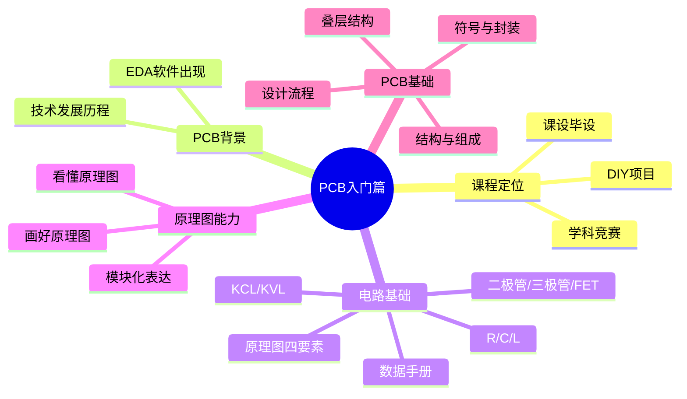
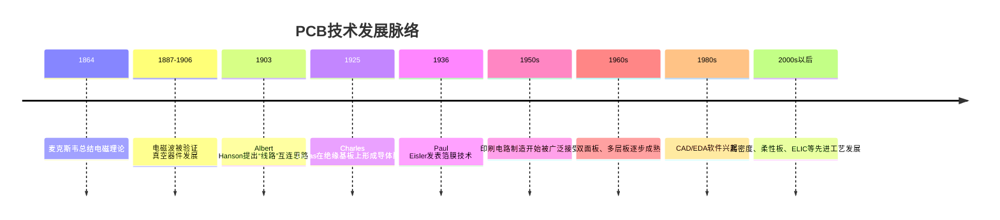

# PCB制图入门篇内容总结

> 适用范围：基于 `入门篇/PPT教学资料` 中第 1 到第 11 课课件整理。  
> 目标：帮助你在短时间内完成一轮系统复习，夯实 PCB 设计入门阶段最核心的基础概念。  
> 说明：本文优先按课件原意归纳，不刻意扩展超出入门篇主线的内容；其中配图采用基于课件内容整理的 Mermaid 示意图，适合在 Obsidian 中直接阅读。

---

## 1. 入门篇到底在讲什么

入门篇的核心任务，不是立刻教你“把板子画出来”，而是先建立一套完整的基础认知链条：

1. 先知道 PCB 是怎么来的，为什么现代电子设计离不开它。
2. 再补齐电路分析基础，知道常见元件和基础电路规律。
3. 然后学会看原理图、画原理图，理解“电气连接”到底如何表达。
4. 最后过渡到 PCB 本体：结构、叠层、符号、封装、设计流程。

也就是说，入门篇解决的是“为什么这样设计、图纸在表达什么、板子由什么构成、从哪一步走到哪一步”的问题。

---

## 2. 第一课：课程介绍

这一课主要是定方向，不是技术细节课，但它很重要，因为它明确了整套课程的学习路径。

### 2.1 课程面向的人群

课件明确提到，这套内容适合：

- 学科竞赛
- 课设毕设
- DIY 与电子爱好者

这说明课程不是纯理论路线，而是明显偏“能落地做板子”的工程导向。

### 2.2 课程结构

课件把内容分成三段：

- 入门篇：PCB 技术发展历程、电路分析基础、PCB 设计基础知识及技巧
- 强化篇：立创 EDA 专业版操作指南、简单电路设计、简单电子系统原理图与 PCB 设计
- 大师篇：复杂电路 PCB 设计、高速电路初步

复习时要记住：**入门篇不是软件操作篇，而是认知地基篇。**

### 2.3 为什么选立创 EDA

课件给出的关键词是：

- 国产
- 易用
- 免费
- 轻量

从学习路径上看，这意味着它很适合新手快速进入“画原理图 + 画 PCB + 导出生产文件”的完整闭环。

---

## 3. 第二课：PCB 技术发展历程

这一课的意义在于让你知道，PCB 不是孤立冒出来的，而是电子学、材料、制造和计算机辅助设计共同推动的结果。

### 3.1 发展主线

### 3.2 你需要记住的关键节点

#### 3.2.1 理论起点：电磁学

课件以麦克斯韦为开端，强调现代电子技术的底层理论来自电磁学。没有电磁理论，就无法系统理解信号传输、耦合、辐射、阻抗这些后续问题。

#### 3.2.2 工程需求：人工布线太低效

在 PCB 大规模应用前，电子设备往往依靠人工导线连接器件，成本高、效率低、可靠性差。  
PCB 的本质价值，就是把“手工连线”变成“可复制、可制造、可规模化”的印制互连。

#### 3.2.3 PCB 概念的形成

课件提到几个关键人物和节点：

- 1903 年，Albert Hanson 提出线路导体和层间导通思路
- 1925 年，Charles Ducas 在绝缘基板上印刷线路并电镀形成导体
- 1936 年，Paul Eisler 发表箔膜技术，常被称为“印刷电路之父”

这些信息说明：**PCB 的核心不是“板子”，而是“在绝缘基板上形成可制造的导电互连结构”。**

#### 3.2.4 大规模普及阶段

课件指出，从 1950 年代开始，蚀刻工艺主导，单面板、双面板、多层板逐步工业化。随着晶体管与集成电路走向实用，PCB 成为电子产品的基础载体。

#### 3.2.5 EDA 软件的出现

课件把 1980 年代前后的个人计算机普及与 CAD/EDA 软件出现联系起来。  
这是一个很关键的认识点：

- 没有 EDA，设计效率低
- 有了 EDA，原理图、PCB、Gerber、制造流程被串起来
- 软件使复用、修改、验证、生产交付都更高效

### 3.3 复习结论

这课最该记住的一句话：

> PCB 的发展，是电子系统复杂度不断上升后，对“高可靠互连 + 可制造 + 可复用 + 自动化设计”的必然回应。

---

## 4. 第三课：电路分析基础上篇

这一课是最基础但最常用的一课，主要解决两个问题：

1. 原理图是什么
2. R、C、L 这三类基础元件分别是什么

### 4.1 什么是电路图 / 原理图

课件先强调“电路图”和实际电路之间存在一一对应关系。  
原理图（Schematic Diagram）本质上是对电路连接关系和功能关系的抽象表达，不是物理摆放图。

### 4.2 原理图四要素

课件明确给出四要素：

- 元件符号
- 连接线
- 结点
- 注释

这四项非常重要，后面第六课、第七课还会反复回到这里。

### 4.3 电阻

课件中的核心信息：

- 电阻是限流元件
- 常用字母 `R` 表示
- 单位是欧姆 `Ω`
- 固定阻值的是固定电阻，可变阻值的是电位器/可变电阻
- 电阻满足欧姆定律 `u = Ri`

#### 4.3.1 电阻在电路中的常见作用

- 限流
- 分压
- 偏置
- 反馈
- 上拉/下拉

#### 4.3.2 电阻读数

课件给出了常见贴片电阻读法：

- 3 位码：前 2 位有效数字，第 3 位表示 10 的幂，常见精度 ±5%
- 4 位码：前 3 位有效数字，第 4 位表示 10 的幂，常见精度 ±1%
- 小于 10Ω 时，常用 `R` 代替小数点，如 `4R7`

### 4.4 电容

课件中的核心信息：

- 电容表示容纳电荷的能力
- 用 `C` 表示
- 单位是法拉 `F`
- 常见单位换算：
 - `1uF = 1000nF`
 - `1nF = 1000pF`
- 入门阶段最重要的功能认识是：**储能与滤波**

课件还强调了大家常背的一句话：

> 电容“通交流、隔直流”

复习时不要把它机械化理解成绝对规律，而要理解为：在不同频率条件下，电容对信号呈现出不同阻抗特性，因此常被用于耦合、去耦、滤波、旁路。

### 4.5 电感

课件中的核心信息：

- 电感能把电能转化为磁能并储存起来
- 用 `L` 表示
- 单位是亨利 `H`
- 常用换算：
 - `1H = 1000mH`
 - `1mH = 1000uH`
- 典型作用：
 - 滤波
 - 扼流
 - 谐振
 - 储能

课件给出的入门级记忆方式是：

> 电感“通直流、隔交流”

同样，这是一种工程化、近似化的入门说法，便于先建立直观认识。

### 4.6 本课复习重点

- 原理图不是实物摆放图，而是连接关系图
- 必须牢牢记住“原理图四要素”
- R/C/L 的字母、单位、主要作用要张口就来
- 电阻编码和电容单位换算是高频基础题

---

## 5. 第四课：电路分析基础中篇

这一课进入半导体器件，内容包括：

- 二极管
- 三极管
- 场效应管
- 芯片 / IC 的初步认识

### 5.1 二极管

课件对二极管的定义很清晰：

- 二极管由半导体材料制成
- 有阳极和阴极两个电极
- 正向加压导通，反向加压截止
- 具有单向导电性

从复习角度看，二极管最重要的不是背概念，而是记住它常被拿来做什么：

- 整流
- 检波
- 限幅
- 钳位
- 稳压
- 保护

#### 5.1.1 课件提到的二极管类型

- 普通二极管：单向导电
- 肖特基二极管：恢复时间短、压降低，适合高频、低压、大电流场景
- 稳压二极管 / 齐纳二极管：利用反向击穿稳压
- TVS 二极管：用于浪涌与尖峰抑制
- 变容二极管：结电容随反偏变化，多用于高频调谐
- 发光二极管：电致发光

### 5.2 三极管

课件强调三极管是“控制电流的半导体器件”，既可以放大，也可以当开关。

#### 5.2.1 结构与类型

- 全称：半导体三极管 / 双极型晶体管
- 结构：发射极、基极、集电极
- 类型：`NPN` 与 `PNP`

#### 5.2.2 三种典型工作状态

课件对这三种状态给了非常明确的入门描述：

- 截止：发射结反偏、集电结反偏，基本不导通，相当于开关断开
- 放大：发射结正偏、集电结反偏，可实现电流放大
- 饱和：发射结正偏、集电结正偏，相当于开关接通

复习时你需要做到：

- 能区分三极管和二极管的功能层级不同
- 知道三极管既能放大，也能作开关
- 看到三极管时能立刻想到截止/放大/饱和三态

### 5.3 场效应管 FET / MOS

课件把场效应管定义为：利用输入回路电场效应控制输出回路电流的器件，属于电压控制型半导体器件。

#### 5.3.1 课件强调的特点

- 输入电阻高
- 噪声小
- 功耗低
- 动态范围大
- 易于集成
- 安全工作区较宽

#### 5.3.2 课件给出的分类

- 结型场效应管 JFET
- 金属氧化物半导体场效应管 MOSFET

按沟道分：

- PMOS
- NMOS

按工作型态分：

- 增强型
- 耗尽型

因此常见 MOS 管可以按课件概括成四类：

- 增强型 PMOS
- 增强型 NMOS
- 耗尽型 PMOS
- 耗尽型 NMOS

### 5.4 芯片 / IC 的基础认识

课件最后引入芯片/IC，说明在实际电子系统中，很多功能不是靠离散元件单独完成，而是由专用芯片完成。  
入门阶段你至少要建立这个意识：

- 芯片不是“黑盒子”
- 看不懂芯片，通常不是因为电路太难，而是因为没有养成查数据手册和看参考电路的习惯

### 5.5 本课复习重点

- 二极管：单向导电，先记功能，再记类型
- 三极管：放大与开关，两大用途
- 场效应管：电压控制型器件，重点记 PMOS/NMOS
- 芯片分析必须结合数据手册

---

## 6. 第五课：元件数据手册

这课在文字上不算多，但非常关键，因为它决定你以后是不是“靠猜设计”。

### 6.1 为什么数据手册重要

对于芯片、接口器件、电源芯片、运放、驱动器等器件，**数据手册才是最权威的一手资料**。  
它决定了你能不能正确回答以下问题：

- 引脚定义是什么
- 供电范围是多少
- 最大额定值是多少
- 典型应用电路怎么接
- 关键外围器件怎么选
- 封装尺寸和焊盘怎么画

### 6.2 结合课件，复习数据手册时重点看什么

课件以 `芯片/IC` 和 `TPS5450` 为例引导你建立习惯。  
入门复习时，建议你固定按这个顺序看：

1. `Description / Features`
  - 先确认器件是干什么的，不要一上来就看公式。
2. `Pin Configuration / Pin Functions`
  - 引脚功能必须看清，尤其是电源脚、使能脚、反馈脚、地脚。
3. `Absolute Maximum Ratings`
  - 这是绝对极限，不是推荐长期工作条件。
4. `Recommended Operating Conditions`
  - 真正设计时更应该参考这一部分。
5. `Typical Application`
  - 最适合入门者抄结构、理解外围连接。
6. `Electrical Characteristics`
  - 看阈值、电流、电压、频率、精度等关键指标。
7. `Package Information`
  - 画封装或校验封装时必须看。

### 6.3 初学者最常犯的错误

- 只看器件名字，不看完整型号
- 只看淘宝/商城描述，不看原厂手册
- 把绝对最大额定值当成正常工作值
- 不看典型应用图就直接画原理图
- 不核对封装尺寸、焊盘间距、1 脚方向

### 6.4 本课复习结论

课件最后一句“无他，惟手熟尔”很到位。  
查手册这件事没有捷径，本质就是：

> 多查、多画、多对照参考电路，直到看到器件型号就知道先翻哪些页面。

---

## 7. 第六课：电路定理

这一课是电路分析的硬基础，重点包括：

- 连接线、结点、网络标签
- 支路、回路、网孔
- 集总参数电路
- 基尔霍夫电流定律 KCL
- 基尔霍夫电压定律 KVL

### 7.1 连接线、结点、网络标签

课件先回到原理图基本表达方式：

- 连接线：在原理图中表示导线连接关系；在 PCB 中往往对应铜箔导线或铜皮
- 结点：表示导通关系，接到同一结点的导线/引脚电气上相连
- 网络标签 Net Label：具有相同网络标号的点，电气上连接在一起

网络标签的意义非常大：

- 简化长连线
- 让图纸更清晰
- 便于模块化原理图表达

### 7.2 支路、回路、网孔

#### 7.2.1 支路

课件定义：由一个或几个串联元件构成、通过同一电流的通路。

#### 7.2.2 回路

课件定义：电路中任意一个闭合路径叫回路。  
在所选回路中，如果至少包含一个未在前面选过的新支路，则这些回路之间可形成独立回路。

#### 7.2.3 网孔

课件定义：不可再分的回路叫网孔。  
对平面电路来说，内部不包含任何支路的回路就是网孔。

### 7.3 集总参数电路

这一点很多人容易忽略，但课件讲得很关键：

- 实际器件中的电磁效应本来是分布在整个物理结构中的
- 为了分析方便，低频条件下可把这些效应“集中”到理想元件上建模
- 这种近似模型称为集总参数电路

课件强调其适用前提：

> 电路尺寸应远小于工作时对应电磁波波长。

这也是为什么 KCL/KVL 在入门和常规低频 PCB 中极其常用，但到了高速、高频、强分布参数问题时，分析方式会逐渐复杂化。

### 7.4 基尔霍夫电流定律 KCL

课件给出的表述是：

> 在集总参数电路中，任意时刻，对任意结点流出（或流入）该结点电流的代数和等于零。

本质理解：

- 它反映的是电荷守恒
- 它约束的是结点电流关系
- 与具体元件性质无关

#### 7.4.1 记忆方法

- 流入和 = 流出和
- 或者统一规定参考方向后，代数和为 0

### 7.5 基尔霍夫电压定律 KVL

课件给出的表述是：

> 在集总参数电路中，任一时刻，沿任一回路，所有支路电压的代数和恒等于零。

本质理解：

- 它反映的是能量守恒
- 它约束的是回路电压关系
- 同样与支路元件性质无关

#### 7.5.1 记忆方法

- 沿着回路走一圈，电压升和电压降代数和为 0
- 参考方向先定好，列式就不乱

### 7.6 KCL 与 KVL 的课件结论
