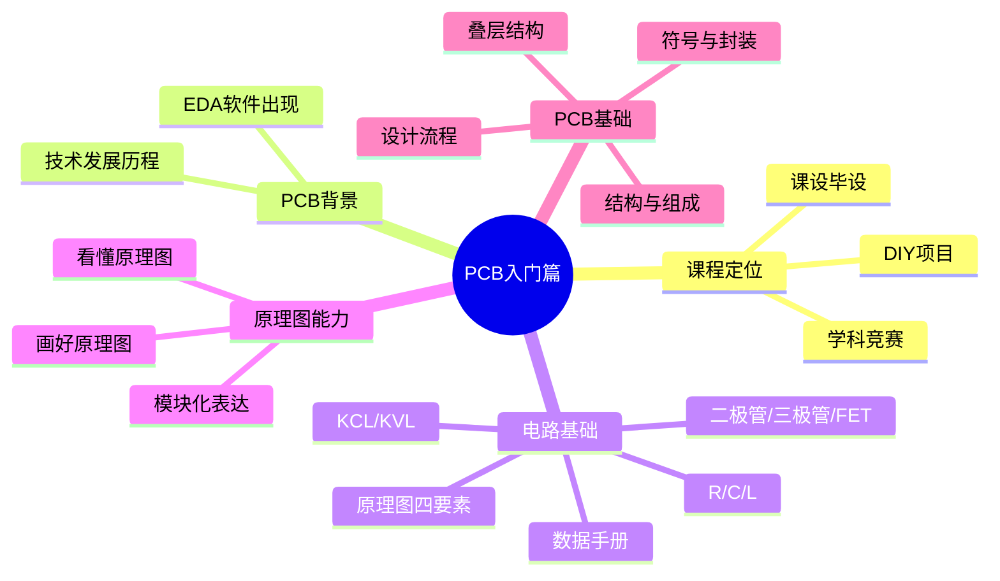
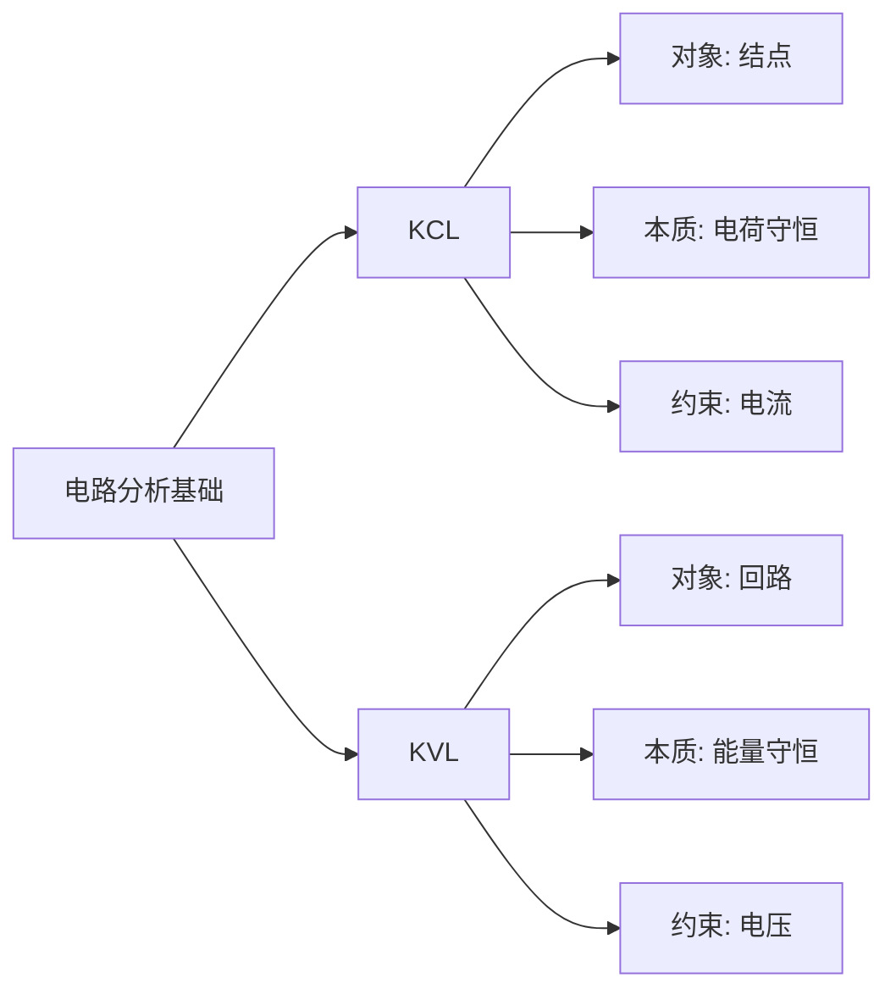

# PCB制图入门篇内容总结
---




---

## 4. 第三课：电路分析基础上篇

这一课是最基础但最常用的一课，主要解决两个问题：

1. 原理图是什么
2. R、C、L 这三类基础元件分别是什么

### 4.1 什么是电路图 / 原理图

课件先强调“电路图”和实际电路之间存在一一对应关系。  
原理图（Schematic Diagram）本质上是对电路连接关系和功能关系的抽象表达，不是物理摆放图。

### 4.2 原理图四要素

课件明确给出四要素：

- 元件符号
- 连接线
- 结点
- 注释

这四项非常重要，后面第六课、第七课还会反复回到这里。

### 4.3 电阻

课件中的核心信息：

- 电阻是限流元件
- 常用字母 `R` 表示
- 单位是欧姆 `Ω`
- 固定阻值的是固定电阻，可变阻值的是电位器/可变电阻
- 电阻满足欧姆定律 `u = Ri`

#### 4.3.1 电阻在电路中的常见作用

- 限流
- 分压
- 偏置
- 反馈
- 上拉/下拉

#### 4.3.2 电阻读数

课件给出了常见贴片电阻读法：

- 3 位码：前 2 位有效数字，第 3 位表示 10 的幂，常见精度 ±5%
- 4 位码：前 3 位有效数字，第 4 位表示 10 的幂，常见精度 ±1%
- 小于 10Ω 时，常用 `R` 代替小数点，如 `4R7`

### 4.4 电容

课件中的核心信息：

- 电容表示容纳电荷的能力
- 用 `C` 表示
- 单位是法拉 `F`
- 常见单位换算：
 - `1uF = 1000nF`
 - `1nF = 1000pF`
- 入门阶段最重要的功能认识是：**储能与滤波**

课件还强调了大家常背的一句话：

> 电容“通交流、隔直流”

复习时不要把它机械化理解成绝对规律，而要理解为：在不同频率条件下，电容对信号呈现出不同阻抗特性，因此常被用于耦合、去耦、滤波、旁路。

### 4.5 电感

课件中的核心信息：

- 电感能把电能转化为磁能并储存起来
- 用 `L` 表示
- 单位是亨利 `H`
- 常用换算：
 - `1H = 1000mH`
 - `1mH = 1000uH`
- 典型作用：
 - 滤波
 - 扼流
 - 谐振
 - 储能

课件给出的入门级记忆方式是：

> 电感“通直流、隔交流”

同样，这是一种工程化、近似化的入门说法，便于先建立直观认识。

### 4.6 本课复习重点

- 原理图不是实物摆放图，而是连接关系图
- 必须牢牢记住“原理图四要素”
- R/C/L 的字母、单位、主要作用要张口就来
- 电阻编码和电容单位换算是高频基础题

---

## 5. 第四课：电路分析基础中篇

这一课进入半导体器件，内容包括：

- 二极管
- 三极管
- 场效应管
- 芯片 / IC 的初步认识

### 5.1 二极管

课件对二极管的定义很清晰：

- 二极管由半导体材料制成
- 有阳极和阴极两个电极
- 正向加压导通，反向加压截止
- 具有单向导电性

从复习角度看，二极管最重要的不是背概念，而是记住它常被拿来做什么：

- 整流
- 检波
- 限幅
- 钳位
- 稳压
- 保护

#### 5.1.1 课件提到的二极管类型

- 普通二极管：单向导电
- 肖特基二极管：恢复时间短、压降低，适合高频、低压、大电流场景
- 稳压二极管 / 齐纳二极管：利用反向击穿稳压
- TVS 二极管：用于浪涌与尖峰抑制
- 变容二极管：结电容随反偏变化，多用于高频调谐
- 发光二极管：电致发光

### 5.2 三极管

课件强调三极管是“控制电流的半导体器件”，既可以放大，也可以当开关。

#### 5.2.1 结构与类型

- 全称：半导体三极管 / 双极型晶体管
- 结构：发射极、基极、集电极
- 类型：`NPN` 与 `PNP`

#### 5.2.2 三种典型工作状态

课件对这三种状态给了非常明确的入门描述：

- 截止：发射结反偏、集电结反偏，基本不导通，相当于开关断开
- 放大：发射结正偏、集电结反偏，可实现电流放大
- 饱和：发射结正偏、集电结正偏，相当于开关接通

复习时你需要做到：

- 能区分三极管和二极管的功能层级不同
- 知道三极管既能放大，也能作开关
- 看到三极管时能立刻想到截止/放大/饱和三态

### 5.3 场效应管 FET / MOS

课件把场效应管定义为：利用输入回路电场效应控制输出回路电流的器件，属于电压控制型半导体器件。

#### 5.3.1 课件强调的特点

- 输入电阻高
- 噪声小
- 功耗低
- 动态范围大
- 易于集成
- 安全工作区较宽

#### 5.3.2 课件给出的分类

- 结型场效应管 JFET
- 金属氧化物半导体场效应管 MOSFET

按沟道分：

- PMOS
- NMOS

按工作型态分：

- 增强型
- 耗尽型

因此常见 MOS 管可以按课件概括成四类：

- 增强型 PMOS
- 增强型 NMOS
- 耗尽型 PMOS
- 耗尽型 NMOS

### 5.4 芯片 / IC 的基础认识

课件最后引入芯片/IC，说明在实际电子系统中，很多功能不是靠离散元件单独完成，而是由专用芯片完成。  
入门阶段你至少要建立这个意识：

- 芯片不是“黑盒子”
- 看不懂芯片，通常不是因为电路太难，而是因为没有养成查数据手册和看参考电路的习惯

### 5.5 本课复习重点

- 二极管：单向导电，先记功能，再记类型
- 三极管：放大与开关，两大用途
- 场效应管：电压控制型器件，重点记 PMOS/NMOS
- 芯片分析必须结合数据手册

---

## 6. 第五课：元件数据手册

这课在文字上不算多，但非常关键，因为它决定你以后是不是“靠猜设计”。

### 6.1 为什么数据手册重要

对于芯片、接口器件、电源芯片、运放、驱动器等器件，**数据手册才是最权威的一手资料**。  
它决定了你能不能正确回答以下问题：

- 引脚定义是什么
- 供电范围是多少
- 最大额定值是多少
- 典型应用电路怎么接
- 关键外围器件怎么选
- 封装尺寸和焊盘怎么画

### 6.2 结合课件，复习数据手册时重点看什么

课件以 `芯片/IC` 和 `TPS5450` 为例引导你建立习惯。  
入门复习时，建议你固定按这个顺序看：

1. `Description / Features`
  - 先确认器件是干什么的，不要一上来就看公式。
2. `Pin Configuration / Pin Functions`
  - 引脚功能必须看清，尤其是电源脚、使能脚、反馈脚、地脚。
3. `Absolute Maximum Ratings`
  - 这是绝对极限，不是推荐长期工作条件。
4. `Recommended Operating Conditions`
  - 真正设计时更应该参考这一部分。
5. `Typical Application`
  - 最适合入门者抄结构、理解外围连接。
6. `Electrical Characteristics`
  - 看阈值、电流、电压、频率、精度等关键指标。
7. `Package Information`
  - 画封装或校验封装时必须看。

### 6.3 初学者最常犯的错误

- 只看器件名字，不看完整型号
- 只看淘宝/商城描述，不看原厂手册
- 把绝对最大额定值当成正常工作值
- 不看典型应用图就直接画原理图
- 不核对封装尺寸、焊盘间距、1 脚方向

### 6.4 本课复习结论

课件最后一句“无他，惟手熟尔”很到位。  
查手册这件事没有捷径，本质就是：

> 多查、多画、多对照参考电路，直到看到器件型号就知道先翻哪些页面。

---




---

## 8. 第七课：读懂原理图

这一课开始强调工程表达能力。  
重点不是“会连线”，而是“让别人能看懂你的设计”。

### 8.1 课件核心观点

课件明确说：

> 原理图设计是做好一款产品的基础。  
> 原理图设计的基本要求：规范、清晰、准确、易读。

这四个词非常重要，建议你直接背下来。

### 8.2 原理图可读性为什么重要

课件指出，原理图不是只给自己看的，也要给别人看。  
如果可读性差，会带来沟通成本、调试困难、协作障碍，甚至引发制造和维修问题。

### 8.3 课件总结的“画好原理图”方法

#### 8.3.1 分模块、分图页

把不同功能块拆开表达，例如：

- 电源模块
- 主控模块
- 接口模块
- 传感器模块
- 驱动模块

这样做的好处是：

- 便于阅读
- 便于调试
- 便于后期修改

#### 8.3.2 标注重要参数

特别是符号上不能直接看出来的内容，应主动标注，比如：

- 阻值、电容值
- 电压等级
- 上拉/下拉信息
- 晶振频率
- 接口电平

#### 8.3.3 标注特殊功能或设计意图

课件特别提到：

- 元件特殊/重要功能
- `NC / NF / 0R`
- 快充诱骗请求电压
- 单片机 IO 使用注意事项

这意味着原理图不只是“连上了”，还要说明“为什么这样连”。

#### 8.3.4 合理使用网络标签

课件明确指出，合理的网络标签便于理解、避免重复。  
也就是说，网络标签要：

- 语义清楚
- 命名一致
- 不滥用

例如：

- `3V3`
- `5V`
- `GND`
- `UART_TX`
- `UART_RX`
- `RESET`

#### 8.3.5 标注 Logo / 版本号 / 其他说明

这属于工程文档化意识。  
即便是学生项目，也应逐步养成版本管理和可追溯意识。

### 8.4 本课复习结论

课件最后给出一个很重要的组合公式：

> 成功的原理图设计 = 合理的元件选型 + 正确的电路设计

你可以再补上一句自己的理解：

> 再加上清晰的表达，原理图才真正具备工程价值。

---

## 9. 第八课：PCB 结构与组成

这一课开始真正进入“板子本体”。

### 9.1 PCB 的定义

课件指出：

- PCB 是 `Printed Circuit Board`
- 中文为印制电路板，也常称印刷电路板、印刷线路板
- 它是电子元器件电气连接的提供者

这句话必须理解透：

> PCB 首先是“电气连接平台”，其次才是“器件安装载体”。

### 9.2 课件涉及的板材/类型认知

入门阶段不要求你掌握全部工艺细节，但至少要知道：**不同应用会对应不同材料、散热能力、频率特性和成本。**

### 9.3 PCB 的几个核心构成元素

#### 9.3.1 导线 Track

课件强调：

- 导线与原理图网络一一对应
- 导线带有网标
- 在布线时可推挤、环绕
- 通常用于信号连接

也就是说，PCB 上的导线不是随便画的“线”，而是承担具体电气网络的铜箔互连。

#### 9.3.2 铺铜

课件指出，铺铜通常用于：

- 地 `GND`
- 电源 `POWER`

铺铜的直观意义：

- 增加导电截面积
- 降低阻抗
- 优化回流路径
- 便于大面积地连接

#### 9.3.3 过孔

课件给出的两类作用：

- 电气连接：连接不同层
- 定位/固定：辅助器件位置处理

课件还列了三类过孔：

- 通孔：从顶层打到底层，最常见
- 盲孔：从外层到内层
- 埋孔：位于内层之间，表面不可见

#### 9.3.4 焊盘 Pad

课件指出：

- 元件通过引线孔或焊接端与焊盘连接
- 焊盘与印制导线连接后，实现元件电气连接

入门时要建立一个非常清楚的区分：

- 焊盘是“元件落脚点”
- 导线是“网络连接路径”

#### 9.3.5 丝印

课件明确了丝印的作用：

- 标元件位置
- 标数值/型号
- 标方向
- 标安装提示

所以丝印不是装饰，它直接影响焊接、装配和维修效率。

#### 9.3.6 阻焊

课件给出的作用非常典型：

- 覆盖不需要焊接的铜层
- 防止短路
- 起绝缘和保护铜层作用
- 选择性露出需要焊接的焊盘或器件区域

### 9.4 本课复习图

```mermaid
