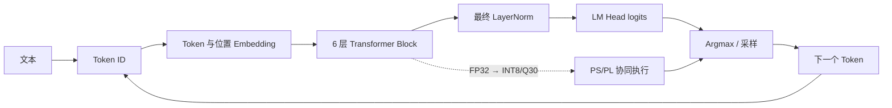

# NanoGPT+FPGA 知识地图

## 项目要解决的问题

把字符级 NanoGPT 从 Python FP32 模型逐步转换成 FPGA 可执行的 INT8/Q30 数据通路，并用可复现证据证明每一层级是否通过。

## 推荐学习顺序

1. [[2026-08-13-01-NanoGPT模型骨架与端到端数据流]]
2. [[2026-08-13-02-Transformer-Block与残差结构]]
3. [[2026-08-13-03-Self-Attention与QKV]]
4. [[2026-08-13-04-训练循环与参数更新]]
5. [[2026-08-13-05-自回归生成循环]]
6. [[2026-08-13-06-字符数据准备]]
7. [[2026-08-13-07-INT8量化与Q30硬件参数]]
8. [[2026-08-13-08-Zynq-PS与PL协同架构]]

## 实验与工程入口

- [[2026-08-13-01-W8A8量化与Q30参考实验]]
- [[2026-08-13-02-PS-main硬件契约]]
- [[2026-08-13-03-PL数据流与HLS算子]]
- [[2026-08-13-04-Vivado-Vitis与BOOT部署链]]
- [[2026-08-13-05-JTAG单Token板级验证]]
- [[2026-08-13-06-参数级修改与安全验证方法]]
- [[2026-08-13-FFN-only残差误读导致AXI错误]]

## 当前项目状态

> [!success] 已由当前版本证据确认
> - 模型配置：6 层、6 头、特征维度 384、最大上下文 256、词表 65。
> - W8A8 量化 PPL：FP32 为 4.333494，INT8 为 4.509458，回退 4.060572%，低于 10% 门槛。
> - 当前权重指纹：`0f6b6bf5376041c66704377b90fb0937e9c4774d8a139f4853b843063baa5ab7`。
> - Vivado 2026.1 综合、实现和 FXF2 Bitstream 已完成。
> - Vitis 2026.1 Platform 与 PS ELF 已构建。
> - 2026-08-09：真实 Zynq-7020 通过 JTAG 完成 `ROMEO:` 单 Token 推理；Token ID 为 `0`，PS 返回码为 `0`，AXI 错误为 `0`。

> [!warning] 仍需现场证据
> - SD 卡断电脱机启动。
> - UART 提示词输入与字符输出。
> - 当前权重版本的 8、20、200 Token 板级生成。
> - 当前版本板端序列与 Python Q30 逐 Token 对齐。
> - 三次稳定性与性能测试。

## 状态判定原则

| 证据层级 | 能证明什么 | 不能扩大成什么 |
|---|---|---|
| Python 自一致性 | 参考文件能被同一算法复现 | FPGA 已对齐 |
| HLS C 仿真 | 单算子 C/C++ 行为符合测试台 | Bitstream 或板级通过 |
| Vivado 构建 | RTL 可综合、实现并满足当前报告约束 | PS 软件和真实推理通过 |
| Vitis Build | PS 软件能编译生成 ELF | 板上运行通过 |
| JTAG 单 Token | 当前输入下 PS/PL 单步闭环通过 | SD/UART/多 Token 通过 |
| SD + UART + 多 Token | 脱机系统链路通过 | 仍需单独核对 Python 对齐和性能 |

## 工程文件地图

| 层级 | 关键位置 | 作用 |
|---|---|---|
| Python 模型 | `python/nanoGPT/model.py` | GPT、Block、Attention、MLP |
| 训练与生成 | `train.py`、`sample.py` | 参数更新与自回归生成 |
| 数据 | `data/shakespeare_char/` | 字符表、train.bin、val.bin |
| 量化 | `01_VSCode_Python/`、`python/nanoGPT/tools/` | W8A8、动态 scale、Q30 参数、参考输出 |
| PS 软件 | `ps/src/main.c` | UART、寄存器、DDR、六层调度和 Token 解码 |
| HLS 源码 | `hls/source/` | 矩阵乘、注意力、LayerNorm、GELU/Embedding |
| PL 顶层 | `fpga/rtl/` | HLS IP 连接、状态机、AXI 和 UART 桥 |
| Vivado | `vivado_project/nano_gpt.xpr` | 综合、实现、Bitstream、XSA |
| Vitis | `vitis/` | Platform、BSP、FSBL 和 PS ELF |

## 来源

完整归并关系见 [[00-资料来源与归并映射]]；23 份原始资料保存在 `05-来源/原始资料/`。
