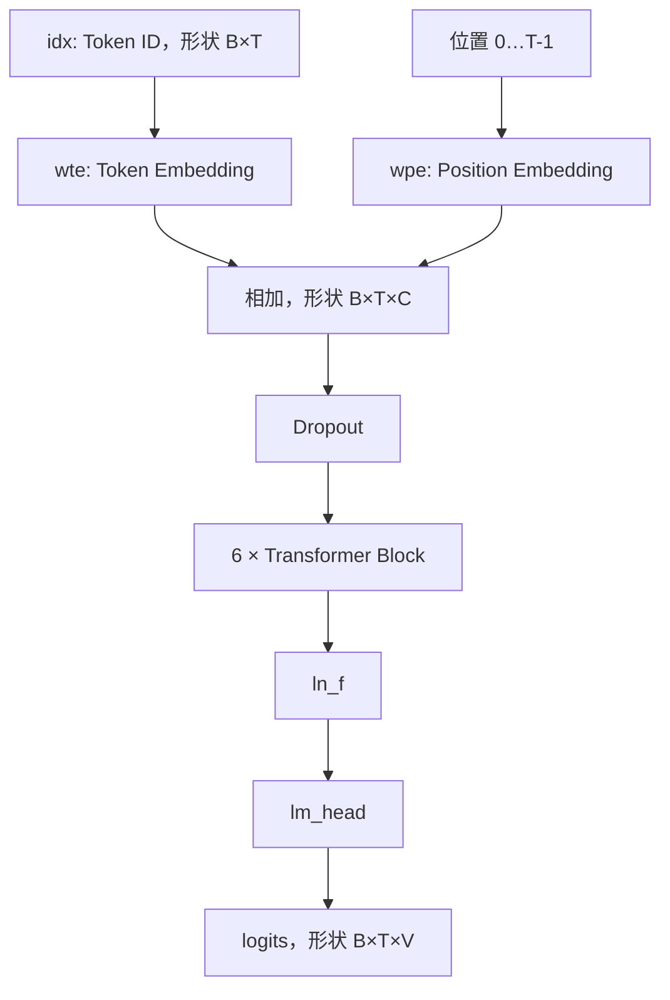

# 第一章：NanoGPT 模型骨架与端到端数据流

## 本章要解决的问题

一个字符怎样变成模型输入，又怎样经过 6 层 Transformer 变成下一个字符？

## 总体数据流

## 关键符号

| 符号 | 含义 | 本项目典型值 |
|---|---|---:|
| B | Batch，批次大小 | 运行时决定 |
| T | Token 序列长度 | 最大 256 |
| C | Channel/Embedding 特征维度 | 384 |
| V | Vocabulary 词表大小 | 65 |

## 核心机制

1. `wte(idx)` 把每个 Token ID 查表成一个 384 维语义向量。
2. `wpe(pos)` 为每个位置提供顺序信息；它的最后一维必须与 `C` 对齐。
3. 两种 Embedding 相加后，形状保持 `(B,T,C)`。
4. 6 个 Block 不改变外部形状，但不断融合上下文并变换特征。
5. `lm_head` 把每个位置的 384 维特征映射成 65 个 Token 分数。

## 训练与推理分支

- 训练时传入 `targets`，对所有位置计算 logits 和交叉熵损失。
- 推理时只需要最后一个位置，因为它表示“基于当前上下文预测下一个 Token”。
- `x[:, [-1], :]` 保留时间维，结果为 `(B,1,C)`；`x[:, -1, :]` 去掉时间维，结果为 `(B,C)`。

## 代码位置

`D:/FPGA/NanoGPT/nanogpt-zynq-backups-main/python/nanoGPT/model.py`

重点对象：`GPTConfig`、`GPT`、`transformer.wte`、`transformer.wpe`、`transformer.h`、`transformer.ln_f`、`lm_head`。

## 易错点与边界

- `wpe` 的特征维是 `C`，不是词表维 `V`。
- 形状不变不表示数据没变；Block 的意义主要体现在数值和上下文信息变化。
- “只算最后一个位置的 lm_head”不等于模型只看最后一个 Token，前面的上下文已经被注意力融合进最后位置特征。

## 练习与费曼复述

1. 用自己的话解释 `B、T、C、V`，并说出 `lm_head` 前后的形状。
2. 为什么位置 Embedding 不能是 `(T,V)`？
3. 为什么推理时只取最后一个位置仍然利用了全部上下文？

## 来源

- `05-来源/原始资料/01_模型骨架.md`
- `05-来源/原始资料/14_学习状态总结与一周FPGA部署学习计划.md`
