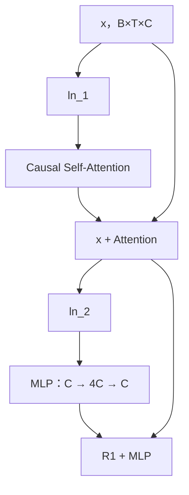

# 第二章：Transformer Block 与残差结构

## 本章要解决的问题

单个 Block 怎样在不改变 `(B,T,C)` 形状的情况下完成“跨位置交流”和“单位置深加工”？

## 数据流



本项目采用 Pre-LN（Pre-Layer Normalization，前置层归一化）：先归一化，再进入 Attention 或 MLP。

## 两个子模块的分工

- Attention：让某个位置读取前面位置的信息，解决 Token 之间如何通信。
- MLP（Multi-Layer Perceptron，多层感知机）：对每个位置独立进行非线性特征变换，典型维度为 `384 → 1536 → 384`。

## 残差连接为什么重要

残差相当于“保留原稿，再叠加修改稿”：

```text
输出 = 原输入 + 子模块产生的修正量
```

它提供信息与梯度的直通路径，避免深层网络只能依赖每个子模块完整重建信息。

## 已有实验

输入 `batch_size=2`、`block_size=4`、`n_embd=384` 时，Block 内各关键节点形状均为 `(2,4,384)`，但两次残差相加后的数值均发生变化。

结论：Block 的外部接口稳定，内部完成上下文融合和特征变换。

## 易错点与边界

- MLP 不在 Token 位置之间交换信息；跨位置交互由 Attention 完成。
- 残差不是“把结果恢复原样”，而是保留输入并叠加增量。
- 本项目板级实现中，一部分 LayerNorm 和残差由 PS 软件执行，矩阵乘和注意力主要由 PL 执行；算法结构与硬件分工不要混为一谈。

## 练习与费曼复述

1. 为什么 Attention 和 MLP 都保持输入输出形状一致？
2. 用“原稿和修改稿”解释两次残差连接。
3. 如果去掉 Attention，只保留 MLP，模型还能够融合前文信息吗？为什么？

## 来源

- `05-来源/原始资料/02_Transformer_Block.md`
- `05-来源/原始资料/18_第1天讲义_PS_main.c硬件契约段.md`
