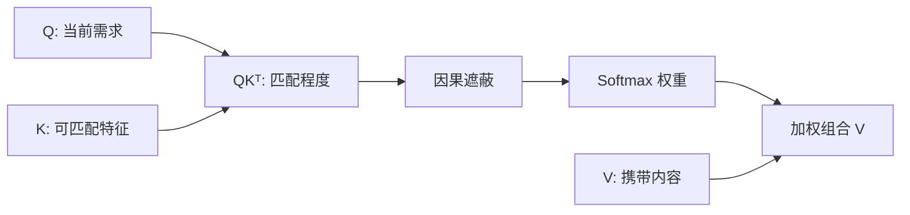

# 第三章：Self-Attention 与 QKV

## 本章要解决的问题

当前位置如何判断应该参考哪些历史 Token，并把它们的信息按重要程度组合起来？

## Q、K、V 的直觉

- Q（Query，查询）：“我现在想找什么？”
- K（Key，键）：“我具有哪些可被匹配的特征？”
- V（Value，值）：“如果参考我，应该取走什么信息？”

`c_attn(x)` 把 `(B,T,C)` 一次映射为 `(B,T,3C)`，随后沿最后一维切成三个 `(B,T,C)` 张量。Q、K、V 不是空矩阵，而是由训练得到的线性层参数生成。

## 注意力计算

```text
scores = QKᵀ / √hs
A      = Softmax(mask(scores))
O      = A × V
```

本项目 `C=384`、`H=6`，所以每头维度 `hs=C/H=64`。

| 节点 | 形状 |
|---|---|
| Q、K、V | `(B,H,T,hs)` |
| QKᵀ | `(B,H,T,T)` |
| 注意力权重 A | `(B,H,T,T)` |
| A×V | `(B,H,T,hs)` |
| 多头拼接 | `(B,T,C)` |
| 输出投影 | `(B,T,C)` |

`(T,T)` 的行表示查询位置，列表示被参考位置。

## 因果遮蔽

第 `i` 个位置只能看到 `0…i`，不能看到未来 Token。软件路径通常把未来分数设为负无穷；HLS 示例中把 `j>i` 的分数设为 `-32768`，再让对应权重变为 0。



## 已有实验观察

测试中得到：`qkv=(2,4,1152)`、`heads=(2,6,4,64)`、`scores=(2,6,4,4)`，未来位置最大权重为 0。第 0 行权重为 `[1,0,0,0]`，说明第 0 个位置只能参考自己。

## 易错点与边界

- 用 Q 和 K 计算“相关性”，用 V 承载被取走的信息；不能用 V 替代 K 计算匹配。
- 多头不是复制同一注意力，而是让不同参数子空间学习不同关系。
- `x[:, [-1], :]` 保留时间维；硬件接口或后续矩阵运算常依赖这个维度。
- FPGA 中 Softmax 常用 LUT 近似，不等于逐元素运行浮点 `exp()`。

## 练习与费曼复述

1. 为什么分数使用 `QKᵀ`，最终输出却使用 `AV`？
2. 解释 `(B,H,T,T)` 中两个 `T` 分别表示什么。
3. 如果没有因果遮蔽，训练语言模型会出现什么信息泄漏？

## 来源

- `05-来源/原始资料/03_Self_Attention_QKV.md`
- `05-来源/原始资料/19_第2天讲义_PL数据流与HLS算子.md`
