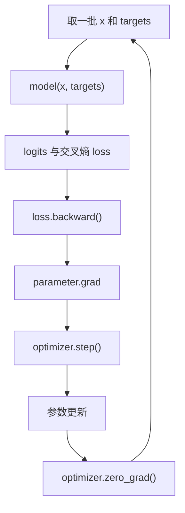

# 第四章：训练循环与参数更新

## 本章要解决的问题

模型怎样从“预测错误”得到参数应该往哪个方向修改的信息？

## 训练闭环



## 关键机制

- `targets` 是每个输入位置对应的正确下一个 Token ID。
- logits 形状为 `(B,T,V)`；交叉熵接口按“样本 × 类别”读取，所以把它展平成 `(B×T,V)`。
- targets 同步展平成 `(B×T,)`，保证每个位置都对应一个类别标签。
- `loss.backward()` 根据计算图把误差反向传播到每个可训练参数的 `.grad`。
- `optimizer.step()` 使用梯度和学习率更新参数。
- `optimizer.zero_grad()` 清除本轮梯度，避免与下一轮意外累积。

AdamW（Adaptive Moment Estimation with Decoupled Weight Decay，带解耦权重衰减的自适应矩估计）负责参数更新。GradScaler（Gradient Scaler，梯度缩放器）在混合精度训练时放大损失，降低 FP16 小梯度下溢风险。

## 已有梯度实验

```text
after_backward_grad_is_none=False
grad_norm=8.567618
after_step_param_changed=True
after_zero_grad_is_none=True
```

证据链：反向传播产生梯度 → 优化器确实改变参数 → 清零后梯度恢复为空。

## 代码位置

`D:/FPGA/NanoGPT/nanogpt-zynq-backups-main/python/nanoGPT/train.py`

## 易错点与边界

- `backward()` 只计算梯度，不直接更新参数。
- `step()` 更新参数，但不会自动清掉旧梯度。
- `view(-1,V)` 合并的是 B 和 T，不是丢弃序列信息；它只是为了匹配损失函数接口。
- 训练时的 Dropout 和推理时的评估模式应区分。

## 练习与费曼复述

1. 解释 `backward → grad → step → zero_grad` 的因果顺序。
2. 为什么 logits 和 targets 必须以相同顺序展平？
3. 如果忘记 `zero_grad()`，下一轮会发生什么？

## 来源

- `05-来源/原始资料/04_train_训练循环.md`
