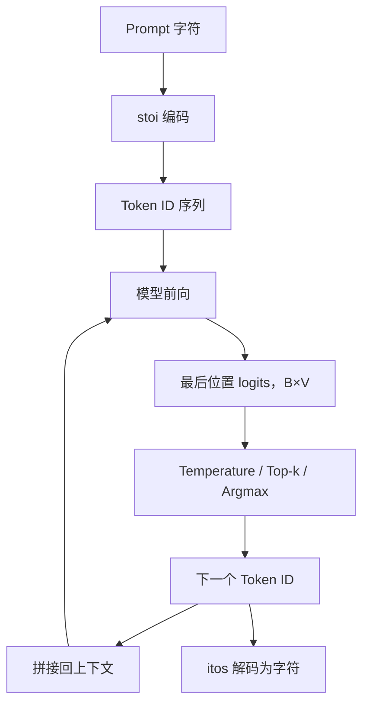

# 第五章：自回归生成循环

## 本章要解决的问题

模型如何从一个 Prompt 开始，每次预测一个 Token，并把预测结果继续作为输入？

## 生成数据流

## 为什么只看最后位置

最后位置的隐藏状态已经通过因果注意力汇聚当前上下文，因此 `logits[:, -1, :]` 表示“给定全部已有 Token，下一个 Token 的 65 个候选分数”。

## 三种选择机制

| 机制 | 作用 | 是否适合硬件严格对齐 |
|---|---|---|
| Temperature | 调整概率分布尖锐程度 | 不单独决定确定性 |
| Top-k | 只保留分数最高的 k 个候选 | 配合随机采样时仍不确定 |
| Greedy Argmax | 直接选择最高分 Token | 适合逐 Token 对齐 |

随机采样适合生成多样文本，但不适合作为 Python 与 FPGA 的严格一致性基线；硬件验收优先比较确定性 Argmax Token ID。

## 已有对比实验

在 Python FP32 与 Q30/INT8 两条路径都使用贪心选择时，20 个 Token 中 19 个一致；第 20 个位置出现空格与换行差异，匹配率 95%。这说明量化误差可能改变分数接近的候选排序，但该结果仍是 Python 对 Python，不是板级结论。

## 代码位置

- `python/nanoGPT/sample.py`
- `01_VSCode_Python/02_token_console.py`

## 易错点与边界

- 字符相同不一定能替代 Token ID 对齐；严格验收应保留 ID 序列。
- 随机种子相同也不能自动保证浮点与定点采样完全一致。
- “生成 200 Token”意味着循环执行 200 次下一 Token 推理，不是一次输出 200 个独立分类结果。

## 练习与费曼复述

1. 为什么 `logits[:, -1, :]` 足以预测下一个 Token？
2. 为什么硬件对齐实验应优先使用 Argmax？
3. 如果第 20 个 Token 才出现差异，前 19 步的一致能说明什么，不能说明什么？

## 来源

- `05-来源/原始资料/05_sample_生成循环.md`
- `05-来源/原始资料/09_第七章完整实验记录.md`
