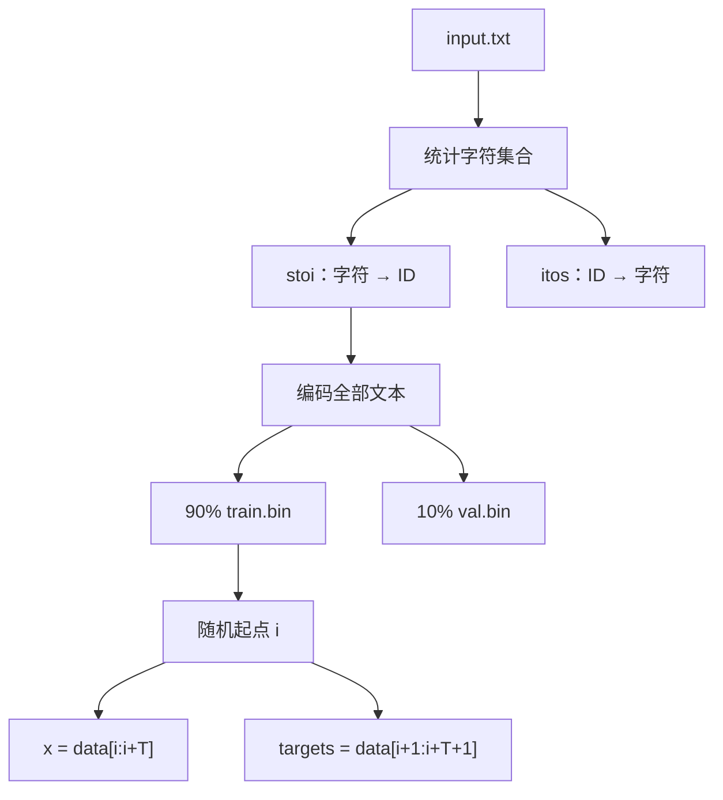

# 第六章：字符数据准备

## 本章要解决的问题

原始莎士比亚文本怎样变成训练循环可以随机读取的输入与标签？

## 数据流

## 文件职责

| 文件 | 作用 |
|---|---|
| `input.txt` | 原始字符文本 |
| `train.bin` | 训练 Token ID 序列 |
| `val.bin` | 验证 Token ID 序列 |
| `meta.pkl` | 保存 `stoi`、`itos` 和词表信息 |

词表只有 65 个字符，Token ID 最大为 64，因此用 `uint16` 保存已经足够，并能比 32 位整数节省一半空间。

## 为什么随机选择窗口

每次随机选择长度为 `block_size` 的连续片段，可以让模型看到不同上下文。targets 是同一片段右移一位后的序列，因此模型在每个位置学习预测下一个字符。

## 已有数据检查

| 项目 | 结果 |
|---|---:|
| 原始字符数 | 1,115,394 |
| 词表大小 | 65 |
| 训练 Token 数 | 1,003,854 |
| 验证 Token 数 | 111,540 |
| dtype | `uint16` |
| 最大 Token ID | 64 |
| 解码前 20 字符 | `First Citizen: Befor` |

检查结论：`DATA_CHECK=PASS`。

## 代码位置

- `python/nanoGPT/data/shakespeare_char/prepare.py`
- `python/nanoGPT/data/shakespeare_char/meta.pkl`

## 易错点与边界

- `meta.pkl` 与模型/板端字符表必须一致，否则同一个 Token ID 会被解释成不同字符。
- train/val 是按序列切分后的两个数据集；随机窗口只发生在各自数据集内部。
- Prompt 协议中的数字前缀不是模型词表的一部分，板端程序会先解析协议头。

## 练习与费曼复述

1. 为什么 targets 比 x 向右移动一个位置？
2. 为什么词表为 65 时 `uint8` 理论上也够，但项目仍可能使用 `uint16`？
3. 如果 Python 与 PS 的 itos 表顺序不同，会出现什么现象？

## 来源

- `05-来源/原始资料/06_数据准备.md`
- `05-来源/原始资料/18_第1天讲义_PS_main.c硬件契约段.md`
