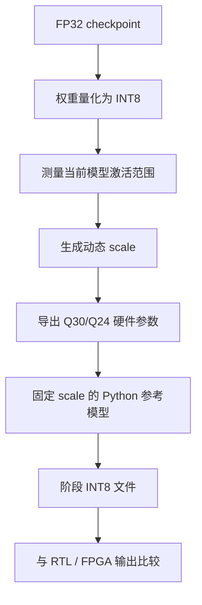

# 第七章：INT8 量化与 Q30 硬件参数

## 本章要解决的问题

怎样把依赖 FP32 的模型转换为 FPGA 适合的整数计算，同时控制精度损失并保证版本一致？

## 量化关系

```text
q = round(x / scale)
x ≈ q × scale
```

- INT8 保存量化后的权重或激活。
- scale 说明一个整数单位对应多少浮点值。
- W8A8 表示 Weight 8-bit、Activation 8-bit，即权重和激活均为 8 位。
- Q30 用整数表示带 30 位小数精度的定点比例，便于硬件用乘法和移位完成缩放。

## 完整链路



## 为什么先动态再固定

动态运行用于观察当前 checkpoint 各阶段的真实范围；固定 scale 才是可复现、可交给硬件的契约。直接使用旧模型的 scale，会把当前激活映射到错误的整数范围。

## 当前版本事实

| 项目 | 当前值 |
|---|---|
| 模型 | 6 层、6 头、384 特征、65 词表 |
| 权重 SHA256 | `0f6b6bf5...5ab7` |
| GELU scale | `0.08527148514986038` |
| FP32 PPL | 4.333494 |
| INT8 PPL | 4.509458 |
| PPL 回退 | 4.060572%，PASS |

旧部署包曾使用 `60ff6e...` 指纹和不同 GELU scale，不能与当前权重、DDR 镜像或阶段参考混用。

## shift 的硬件含义

INT8×INT8 会产生更宽乘积，累加 384 项后数值更大。右移 `n` 位相当于除以 `2^n`，用于把结果压回目标定点范围。例如 `q_shifts[0]=13` 表示第 0 层 Q 累加结果右移 13 位。

shift 少 1 位会让数值约放大 2 倍，可能触发饱和或截位。程序通常不会崩溃，而是“能运行但结果失真”。

## 验证边界

- Python 自一致性 `mismatch=0`：证明参考数据可重复读取和生成。
- FP32/Q30 19/20 Token：证明确定性采样下两条 Python 路径高度接近。
- 两者都不能替代真实 FPGA 阶段或 Token 序列比较。

## 易错点与边界

- 文件名相同不代表参数属于同一模型，必须核对 manifest 和 SHA256。
- `.bin` 通常保存原始二进制阶段数据；`.mem` 常用于硬件初始化或仿真。
- 固定 Attention/GELU LUT 可以跨模型复用的前提是函数格式和量化定义未变；权重和激活 scale 不能随意复用。

## 练习与费曼复述

1. 没有 scale 的 INT8 数字为什么无法恢复数值意义？
2. 为什么 Python 自一致性为 0 不能说明 FPGA 已通过？
3. shift 从 13 改为 12，会怎样沿 Q → Attention → Token 传播？

## 来源

- `05-来源/原始资料/07_量化链路与FPGA前置.md`
- `05-来源/原始资料/09_第七章完整实验记录.md`
- `05-来源/原始资料/15_Vivado至FPGA单Token板级实验记录_2026-08-09.md`
