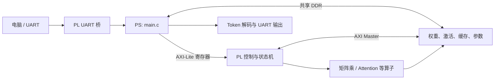

# 第八章：Zynq PS 与 PL 协同架构

## 本章要解决的问题

Transformer 在 Zynq 上并不是全部交给 FPGA 逻辑；PS 和 PL 如何分工，又如何通过寄存器与 DDR 协作？

## 系统全景



## 当前签核链路的分工

| 功能 | 主要执行位置 |
|---|---|
| 字符/Token 编解码 | PS |
| Embedding 构建与调度 | PS + DDR 数据 |
| LayerNorm | 当前主链主要由 PS C 代码执行 |
| Q/K/V、Projection、FFN 矩阵乘 | PL |
| Attention | PL |
| 残差相加 | 当前调用模式中主要由 PS 完成 |
| LM Head 与 Argmax | PL 计算，PS 读取 Token |
| UART 协议与生成循环 | PS，UART 物理桥位于 PL |

## 两种通信方式

1. AXI-Lite 寄存器：PS 写模式、地址、长度和 START；PL 返回状态、错误和结果。
2. 共享 DDR：大块权重和中间数据不通过寄存器逐字搬运，PS 只告诉 PL 数据地址，PL 通过 AXI Master 主动访问。

## 软件调用主线

```text
main
  → uart_console / mailbox command
  → generate_greedy
  → build_hidden
  → run_full_model
  → run_layer × 6
  → pl_lm_head_argmax_row
  → Token 拼接与字符输出
```

一层内部近似为：LayerNorm → Q/K/V → Attention → Projection → 残差 → LayerNorm → FFN → 残差。

## 三层代码关系

```text
hls/source/*.cpp       人写算法源码，改算法从这里开始
        ↓ Vitis HLS
fpga/ip_repo/          自动生成 IP，不手工修改
        ↓ Vivado 例化
fpga/rtl/*.v           人写连接、状态机、寄存器和 UART 桥
```

## 易错点与边界

- 修改 PS 常量通常只需重编 ELF；修改 PL/HLS 则需要重新生成 IP、综合、实现和 Bitstream。
- PS、PL、调试脚本和 BIF 中可能分别保存同一地址契约，改寄存器或 DDR 地址时必须同步。
- 软件 Build 成功只说明 ELF 生成，不能证明板级访存或推理正确。

## 练习与费曼复述

1. 为什么 PS 不把全部权重逐字写入 PL 寄存器？
2. 举例说明“只改 PS”和“改 PL”的构建链差异。
3. 为什么 `fpga/ip_repo/` 不能直接手改？

## 来源

- `05-来源/原始资料/12_Vitis_PS说明.md`
- `05-来源/原始资料/18_第1天讲义_PS_main.c硬件契约段.md`
- `05-来源/原始资料/19_第2天讲义_PL数据流与HLS算子.md`
