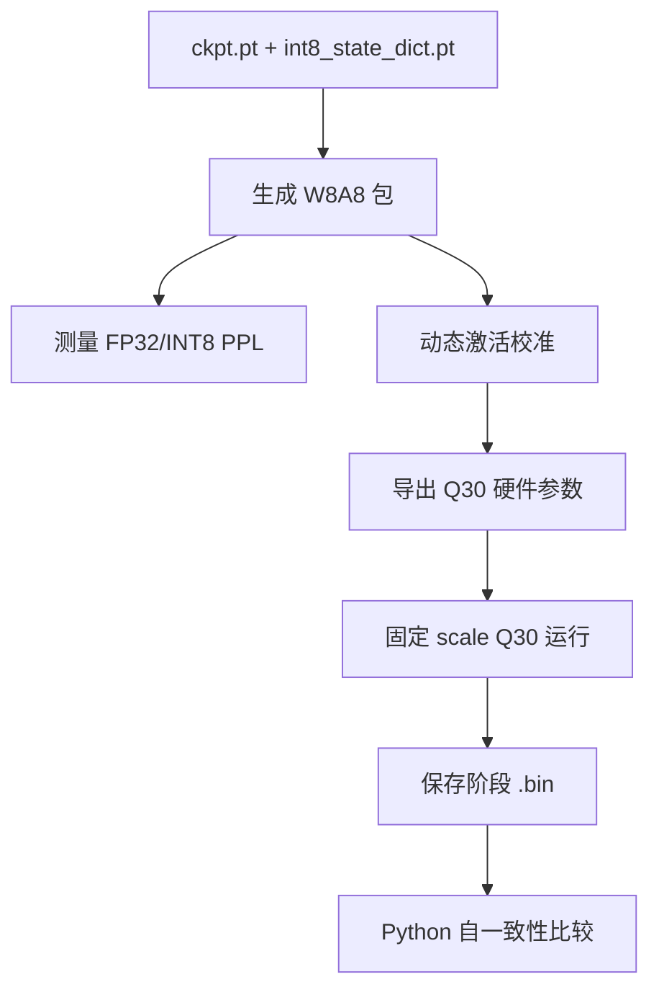

# W8A8 量化与 Q30 参考实验

## 目标与成功判据

验证当前 FP32 模型能否生成 W8A8 量化包，质量回退是否低于 10%，并建立可供后续 RTL/FPGA 比较的固定 Q30 参考数据。

## 环境

- Windows PowerShell
- Python：`D:/FPGA/NanoGPT/venv-gpu/Scripts/python.exe`
- 项目：`D:/FPGA/NanoGPT/nanogpt-zynq-backups-main`
- 模型：6 层、6 头、384 特征、block size 256、词表 65

## 实验链路



## 主要命令

```powershell
Set-Location -LiteralPath "D:\FPGA\NanoGPT\nanogpt-zynq-backups-main\01_VSCode_Python"
& "D:\FPGA\NanoGPT\venv-gpu\Scripts\python.exe" ".\01_quantize_int8.py" --force
```

动态校准和 Q30 导出分别使用：

- `python/nanoGPT/tools/simulate_bittrue_dynamic_int8.py`
- `python/nanoGPT/tools/export_bittrue_hardware_params.py`

## 实际结果

| 指标 | 结果 |
|---|---:|
| 量化模块 | 27 |
| INT8 张量 | 27 |
| Scale 张量 | 52 |
| FP32 状态大小 | 43,080,192 B |
| INT8 权重大小 | 10,765,056 B |
| Scale 大小 | 84,588 B |
| FP32 loss / PPL | 1.466374 / 4.333494 |
| INT8 loss / PPL | 1.506177 / 4.509458 |
| PPL 回退 | 4.060572%，PASS |

动态 scale 提示词为 `everything with a man`；固定 Q30 生成 Token ID `1`，即空格。当前权重 SHA256 为 `0f6b6bf5...5ab7`。

## 自一致性与 FP32 对比

- 固定 Q30 阶段文件重新读取比较：已比较阶段 `mismatch=0`。
- 统一贪心生成 20 Token：FP32 与 Q30/INT8 为 19/20 一致，第 20 位空格/换行不同。

## 结论边界

> [!warning]
> 本实验在 Python 层完成。`mismatch=0` 是 Python 自一致性，不是 FPGA 阶段输出对齐；19/20 也是 Python FP32 对 Python Q30。

## 来源

- `05-来源/原始资料/09_第七章完整实验记录.md`
- [[2026-08-13-07-INT8量化与Q30硬件参数]]
