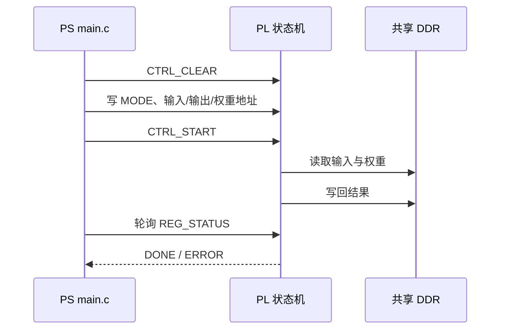

# PS `main.c` 硬件契约

## 目标

看懂 PS 如何通过寄存器、DDR 地址、量化 shift 和 UART 协议调度 PL，而不是逐行记忆约 898 行代码。

## 两个最底层动作

```c
wr32(address, value);  // 向硬件地址写 32 位值
rd32(address);         // 从硬件地址读 32 位值
```

`PL_BASE=0x40000000` 是 PL 寄存器组在 PS 地址空间中的基地址；实际寄存器地址为基地址加偏移。

## 关键寄存器流程



## DDR 地址契约

| 区域 | 示例地址 | 作用 |
|---|---:|---|
| `LAYER_A_BASE` / `LAYER_B_BASE` | `0x10000000` / `0x10020000` | 层间乒乓缓冲 |
| `WEIGHTS_BASE` | `0x11000000` | 量化权重 |
| `K_CACHE_BASE` / `V_CACHE_BASE` | 项目常量 | 每层 KV Cache |
| `TOK_EMB_I8_BASE` | `0x13000000` | Token Embedding |
| `MAILBOX_BASE` | `0x00020000` | PS 与 XSDB/JTAG 调试器交换状态 |

第 N 层某权重地址的通式：

```text
WEIGHTS_BASE + N × LAYER_STRIDE + 层内偏移
```

## 模型和量化常量

- `BLOCK_SIZE=256`
- `VOCAB_SIZE=65`
- `D_MODEL=384`
- `q_shifts/k_shifts/...`：每层定点结果右移位数
- `g_itos`：Token ID 到字符的板端映射；Token `0` 为换行 `0x0A`

## 一次生成调用链

```text
main
→ generate_greedy
→ build_hidden
→ run_full_model
→ run_layer × 6
→ pl_lm_head_argmax_row
→ 拼接 Token
→ 下一轮
```

## 关键理解

- 寄存器主要传控制信息和地址，大块数据放在 DDR。
- 每层 K/V Cache 必须分开，因为各层生成的 K、V 不同。
- 当前主链中 LayerNorm 和残差部分由 PS 计算，矩阵乘、Attention 和 FFN 主要由 PL 计算。
- `MAGIC=0x4E475054` 对应 ASCII `NGPT`，用于证明 PS 程序处于预期协议状态。

## 验收结果

原学习记录显示：第一天 5 项验收全部通过，快问快答 9/10；随后对 PL/HLS 学习时补齐了十六进制地址计算盲区。

## 来源

- `05-来源/原始资料/18_第1天讲义_PS_main.c硬件契约段.md`
- [[2026-08-13-08-Zynq-PS与PL协同架构]]
