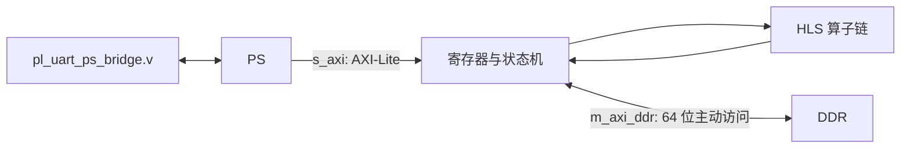

# PL 数据流与 HLS 算子

## 目标

建立 HLS 源码、生成 IP 和手写 RTL 的层级关系，并能说明四个算子的输入、输出和主要硬件技巧。

## 三层代码结构

```text
hls/source/*.cpp        人写算法；算法改动入口
      ↓ Vitis HLS
fpga/ip_repo/           机器生成 IP；只读，不手改
      ↓ Vivado
fpga/rtl/*.v            人写顶层、状态机、寄存器和连接
```

## 四个 HLS 算子

| 算子 | 输入 → 输出 | 核心硬件方法 |
|---|---|---|
| `tiled_matmul` | INT8 矩阵 A、B → 累加结果 | 分块、`PIPELINE II=1`、`UNROLL`、INT32 累加 |
| `mha_kernel` | X 与 Q/K/V 权重 → 注意力特征 | 因果掩码、指数 LUT、定点归一 |
| `layernorm_kernel` | INT8 向量 → 归一化 INT8 | `ap_fixed`、方差钳位、牛顿迭代近似倒平方根 |
| `gelu_embed_kernel` | 数值或 Token ID → 激活/嵌入 | GELU LUT 与 Embedding 查表 |

`ap_int<8>` 表示综合后真正的 8 位有符号硬件数据，不等同于普通 C 的 32 位 `int`。

## 顶层接口



- `s_axi_*`：PS 写控制寄存器的入口。
- `m_axi_ddr_*`：PL 主动访问 DDR 的接口。
- `s_axis/m_axis`：算子间流式数据接口。

## UART 桥

RX 状态机为 `IDLE → START → DATA → STOP`。外部异步 RX 信号先经过双触发器同步，再按 `CLKS_PER_BIT` 在比特中点采样，最终进入 RX FIFO。PS 的 `uart_getc` 和 `uart_putc` 实际通过寄存器访问这些 FIFO。

## 已完成学习验收

- 第 2 天 5 项验收通过，快问快答 8.5/10。
- 十六进制地址计算 3 题全部通过。
- 已能区分“算法源码 → 生成 IP → 手写连接”以及 PS 改动与 PL 改动的影响范围。

## 仍需实验验证

HLS 算子源码阅读不等于 C 仿真或板级通过。修改算子时必须依次完成：测试台 C 仿真 → HLS 综合 → 替换整个 IP → Vivado 实现 → Bitstream → 板级回归。

## 来源

- `05-来源/原始资料/19_第2天讲义_PL数据流与HLS算子.md`
- `05-来源/原始资料/11_Vivado_PL说明.md`
