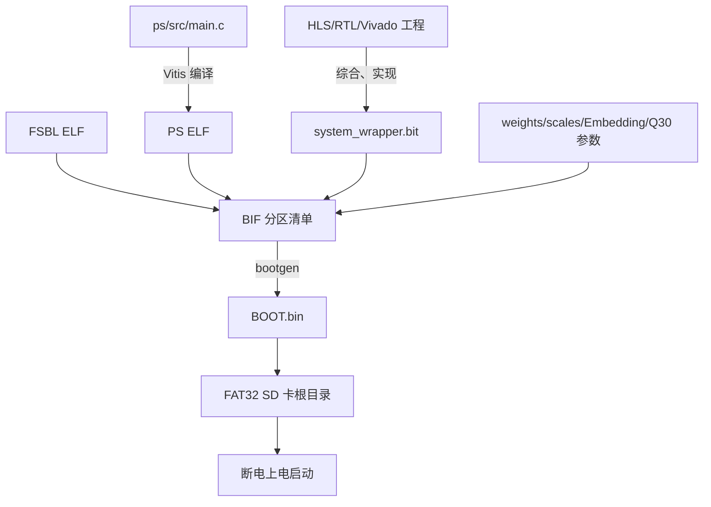

# Vivado、Vitis 与 BOOT 部署链

## 目标与成功判据

理解从 PS C 源码和 PL RTL 到 SD 卡启动镜像的每个产物，并严格区分“成功打包”和“脱机启动通过”。

## 构建链



## BIF 顺序为什么重要

1. FSBL 最先运行，初始化 PS/DDR 并加载后续分区。
2. Bitstream 必须在应用 ELF 前加载，保证 PS 调用 PL 时硬件已配置。
3. 权重和量化数据必须在 ELF 前按 `[load=地址]` 放入 DDR。
4. 应用 ELF 最后启动，此时硬件和数据契约均已就绪。

典型映射：`weights.bin → 0x11000000`、Token Embedding → `0x13000000`、Position Embedding → `0x13010000`。

## 改动影响范围

| 改动 | 必须重做 | 通常不必重做 |
|---|---|---|
| PS `main.c` | Vitis ELF、BOOT.bin、SD 烧录 | Vivado Bitstream |
| HLS 算子 | C 仿真、HLS IP、Vivado 全链、BOOT.bin | 无法只换 ELF |
| 手写 RTL/寄存器 | Vivado 全链，必要时同步 PS 和脚本，再打包 | 不能只编译 PS |
| 仅更换模型数据 | 重新确认所有 manifest/地址/指纹并打包 | 算法未变时未必重综合 |

## 已有证据

- Vivado 2026.1 已生成当前 FXF2 Bitstream。
- Vitis 2026.1 已生成当前 Platform 和 PS ELF。
- 2026-08-09 已生成 `BOOT_fx2_standalone_20260809.bin`，大小 14,923,256 B，SHA256 为 `409C742A...2601F5`。
- 后续“第 3 天空跑”记录显示 Vitis 编译和 bootgen 打包成功，生成大小与签核基准一致。

## 尚未由资料证明

第 3 天因开发板不在手边，SD 脱机启动和 UART 验证按预案暂缓。因此不能把“BOOT.bin 生成成功”写成“SD 脱机部署完成”。

## SD 验收顺序

```text
确认 FAT32
→ 根目录只保留一个 BOOT.bin
→ 安全弹出
→ 开发板完全断电
→ 设置 SD Boot
→ 上电
→ UART 115200 8N1 看 ready
→ 发送 1:ROMEO:
→ 记录 Token ID、字符和错误状态
```

## 来源

- `05-来源/原始资料/20_第3天讲义_全流程空跑_编译到SD卡烧录.md`
- `05-来源/原始资料/15_Vivado至FPGA单Token板级实验记录_2026-08-09.md`
