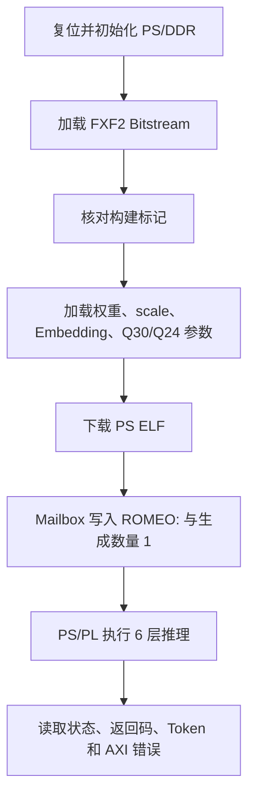

# JTAG 单 Token 板级验证

## 实验结论

2026-08-09（UTC+8），当前 nanoGPT INT8/Q30 模型在真实 Zynq-7020 上通过 JTAG/XSDB 完成单 Token 推理。

| 项目 | 结果 |
|---|---|
| 输入 | `ROMEO:` |
| 生成数量 | 1 Token |
| Token ID | `0` |
| 字符 | `0x0A`，换行 |
| PS 返回码 | `0` |
| PL 状态 | 完成 |
| AXI 错误数 | `0` |
| 硬件标记 | `FXF2 = 0x46584632` |
| 权重 SHA256 | `0f6b6bf5...5ab7` |

## 验收链路



## 产物与指纹

| 产物 | 大小 | SHA256 |
|---|---:|---|
| `system_wrapper.bit` | 4,045,769 B | `952B6ECC...B217` |
| 当前 XSA | 1,323,540 B | `672E78F8...1ED` |
| `ps_mailbox_runner.elf` | 56,720 B | `5035B7A3...673` |
| `weights.bin` | 10,641,792 B | `0F6B6BF5...5AB7` |
| `scales.bin` | 144 B | `297D48D7...AED8` |
| 独立启动包 | 14,923,256 B | `409C742A...01F5` |

## 自动化复验入口

```powershell
& 'D:\FPGA\NanoGPT\deploy_current_20260808\run_fx2_cold_jtag.ps1'
```

底层 Tcl：`deploy_fx2_cold_jtag.tcl`。成功标志为：

```text
DEPLOY_PASS fx2_cold_jtag_romEO_single_token
```

## 结论边界

> [!success]
> 已证明当前 FXF2 RTL、当前权重和当前量化参数能在真实板上完成 JTAG 单 Token PS/PL 协同推理。

> [!warning]
> 未由本实验证明：SD 脱机启动、UART 交互、8/20/200 Token、当前版本 Python Q30 多 Token 对齐、三次稳定性和性能。

## 来源

- `05-来源/原始资料/15_Vivado至FPGA单Token板级实验记录_2026-08-09.md`
- `05-来源/原始资料/16_下一个窗口启动提示词_2026-08-10.md`
