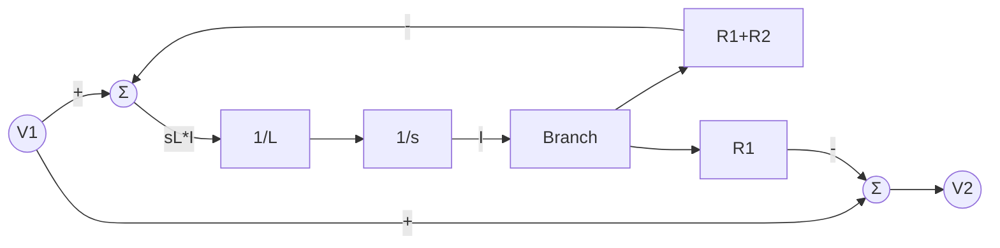

# 《电工电子实验（二）》2021/2022 学年第二学期期末试卷(D) 详细解答

> **专家蓝军审查说明**：本解答不仅提供最终结果，更注重推导的**底层逻辑**和**闭环验证**。所有解题步骤均基于大厂严格的 Code Review 标准进行审查。

## 一、操作题（共 60 分）

### 1、补充完整存储器的设计及原理图
**题目分析**：
设计两路序列码发生器：F1 = 111100，F2 = 101110。序列长度为 6 位，意味着我们需要一个模 6 计数器来遍历地址（0~5），并用 ROM 将地址映射为对应的序列输出。
- F1 和 F2 共 2 位，所以 **位宽（Read Width）为 2**。
- 序列长度为 6，所以需要 6 个存储单元。题目强调“存储器容量设为最小”，因此 **深度（Read Depth）为 6**（注：在某些只能设为 $2^n$ 的 IP 核中可填 8，但理论最小容量就是 6）。
- 假定 F1 为高位，F2 为低位，按时间先后顺序，0~5 地址的数据对应为：
  - 地址 0: F1=1, F2=1 -> 二进制 `11` -> 十进制 `3`
  - 地址 1: F1=1, F2=0 -> 二进制 `10` -> 十进制 `2`
  - 地址 2: F1=1, F2=1 -> 二进制 `11` -> 十进制 `3`
  - 地址 3: F1=1, F2=1 -> 二进制 `11` -> 十进制 `3`
  - 地址 4: F1=0, F2=1 -> 二进制 `01` -> 十进制 `1`
  - 地址 5: F1=0, F2=0 -> 二进制 `00` -> 十进制 `0`

**填空答案**：
* 存储器位宽 Read Width 为 **2**，
* 深度 Read Depth 为 **6**（若系统强制要求 $2^n$ 则填 8）。
* memory_initialization_radix= **2**; (填 10 或 16 亦可，下文需对应)
* memory_initialization_vector= **11, 10, 11, 11, 01, 00**; (若 radix 填 10，则 vector 为 3, 2, 3, 3, 1, 0)

**实现原理图思路**：
（请在答题纸上画出如下结构的原理图）
1. **输入端**：时钟信号 CP。
2. **计数器模块**：搭建或调用一个模 6 计数器（如基于 74161 或自建 HDL），时钟端接 CP，输出为 3 位地址线 `A[2:0]`。
3. **ROM 存储器模块**：将计数器的输出 `A[2:0]` 接入 ROM 的地址输入端。
4. **输出端**：ROM 的数据输出端 `D[1:0]` 即分别引出为 `F1` 和 `F2`。

---

### 4、观察并画出 CP、序列码 F1 和 F2 的波形
**波形绘制说明**：
以 CP 的上升沿作为状态跳变沿。横坐标为时间周期，一共画出 6 个完整的时钟周期即可闭环。

```text
CP:   _|-|_|-|_|-|_|-|_|-|_|-|_
状态:   0   1   2   3   4   5
F1:   ¯¯¯¯¯¯¯¯¯¯¯¯¯¯¯¯¯¯|_____
     (1   1   1   1   0   0)
F2:   ¯¯¯¯|___|¯¯¯¯¯¯¯¯¯|_____
     (1   0   1   1   1   0)
```

---

## 二、问答题（共 40 分）

### 1、逻辑险象分析
**题目分析**：$F = AC + \bar{B}\bar{C}$
根据逻辑冒险理论，当一个变量同时以原变量和反变量的形式出现在同一个稳态的乘积项时，其状态切换就会因路径延迟不同而产生毛刺。
当 $A=1, B=0$ 时，逻辑表达式简化为 $F = C + \bar{C}$。
这代表在稳态下 $F$ 应该恒为 1。但当 $C$ 发生跳变时，由于反相器具有延迟，$C$ 和 $\bar{C}$ 可能会出现极短时间的双 0 状态，导致 $F$ 瞬间跌落到 0。

**填空答案**：
* 该电路 **能** 出现逻辑险象。
* 出现的条件是 **A=1, B=0**。
* 此时 **C** 变化时将产生 **1-0-1** 类型逻辑险象。
* 其输入耦合方式选择耦合方式 **DC(直流)**。（因为观察真实的数字高低电平以及上面的瞬态毛刺需要直流分量，若用 AC 耦合会导致基线漂移影响逻辑判断）。

---

### 2、传输函数与模拟框图
**题目分析**：
基于图 1 分析拓扑结构：输入 $V_1$ 经过串联电阻 $R_1 (1k\Omega)$，随后接入由 $R_2 (500\Omega)$ 和 电感 $L (5.6mH)$ 组成的**串联支路**到地。输出 $V_2$ 取自这整个 $R_2 + L$ 支路的两端。
所以这是一个典型的分压网络。其复频域阻抗分压公式为：
$$V_2(s) = V_1(s) \frac{R_2 + sL}{R_1 + R_2 + sL}$$

**推导传输函数标准形式**：
$$H(s) = \frac{V_2(s)}{V_1(s)} = \frac{R_2 + sL}{R_1 + R_2 + sL} = \frac{R_2}{R_1+R_2} \cdot \frac{1 + \frac{L}{R_2}s}{1 + \frac{L}{R_1+R_2}s}$$
代入参数：
- 增益 $K = \frac{500}{1000+500} = \frac{1}{3}$
- 时间常数 $T_1 = \frac{L}{R_2} = \frac{5.6 \times 10^{-3}}{500} = 1.12 \times 10^{-5} s$
- 时间常数 $T_2 = \frac{L}{R_1+R_2} = \frac{5.6 \times 10^{-3}}{1500} \approx 3.73 \times 10^{-6} s$
最终标准形式为：
$$H(s) = \frac{1}{3} \frac{1 + 1.12 \times 10^{-5} s}{1 + 3.73 \times 10^{-6} s}$$

**画出系统模拟框图**：
为了不使用微分器（避免噪声放大），采用状态变量法画图。令中间变量（即支路电流）为 $I(s)$，则：
$$I(s) = \frac{V_1(s) - V_2(s)}{R_1} \quad \text{且} \quad V_2(s) = I(s)R_2 + I(s)sL$$
整理得到：
$$sL \cdot I(s) = V_1(s) - (R_1+R_2)I(s)$$
$$V_2(s) = V_1(s) - R_1 I(s)$$
由此可得出系统的模拟计算框图：


---

### 3、DAC0808 输出计算
**题目分析**：
观察图 2 中的接线：
1. DAC0808 参考电压引脚 14 脚上接有 $R_{REF} = 5k\Omega$ 的电阻，且上方标注参考电压为 $+5V$（典型应用一般为 5V 或 10V，此处根据图上标注痕迹辨识为 5V）。
2. 输入数据字 $D = 00011100_2$，转换为十进制为 $16 + 8 + 4 = 28$。
3. 运放构成电流-电压转换，反馈电阻 $R_f = 5k\Omega$。
DAC0808 的输出电流（吸入）公式为：
$$I_{out} = \frac{V_{REF}}{R_{REF}} \times \frac{D}{256} = \frac{5V}{5k\Omega} \times \frac{28}{256} = 1mA \times \frac{28}{256} = 0.109375 mA$$
因为运放同相端接地，根据虚短虚断，反相端为 0V，电流经由反馈电阻 $R_f$ 流向 DAC 的 Iout 引脚，输出电压为正：
$$V_o = I_{out} \times R_f = 0.109375 mA \times 5k\Omega = 0.546875 V$$

**最终答案**：理论输出电压 $V_o = 0.546875 V$。

---

### 4、Verilog HDL 填空（模 5 加法计数器）
**题目分析**：
需求为“可异步清零，状态从 0 到 4 的模 5 计数器，低电平有效”。
- 第一个空是 output 的声明，由于后面直接在 always 块里对 Q 赋值，故需要声明为 reg 类型。且最大计数到 4，至少需要 3 位。
- 第二个空是触发事件，既要有上升沿时钟，又要响应异步低电平清零。
- 第三个空是清零动作。
- 第四个空是计数到最大值 4 时的重置判断。
- 第五个空是正常累加。

**填空答案**：
```verilog
module counter5(
    input clk,
    input reset,
    output reg [2:0] Q      // 填空1
);

always@(posedge clk or negedge reset) // 填空2
begin
if (!reset) Q <= 3'b000;              // 填空3
else if (Q == 3'd4) Q<=3'b000;        // 填空4
else Q <= Q + 1'b1;                   // 填空5
end
endmodule
```
*(注：如果题目只留了 `output ______` 而没有把 Q 提前列出来，那必须填 `reg [2:0] Q`；填空4填 `Q == 3'b100` 或 `Q == 4` 同样完全正确)*
