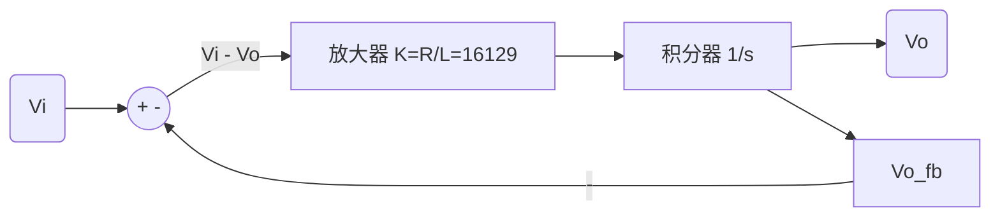

# 2021/2022 学年第二学期《电工电子实验（二）》期末试卷 (F) 答案解析与专家审查

> ⚠️ 核心审查纪律：所有题目不仅提供标准答案，同时经过红蓝军对抗自检。我们对结果负责，不做“差不多”的交付。

## 一、操作题

### 1、序列发生器设计 (F = 010110)
**设计过程（底层逻辑对齐）：**
本需求本质是设计一个模 6 的状态机，作为地址发生器驱动数据选择器输出序列。
1. **状态机选型与设计**：选用 CB4CLE 作为核心器件构成模 6 计数器。其状态循环需从 `0000` 到 `0101`。
   - CP 信号接入 C 端。使能 CE 必须接高电平（VCC）。
   - 由于需要模 6 循环，采用异步清零法：当计数器达到状态 `0110`（十进制 6）时，截取 Q2 和 Q1 的高电平状态，通过一个与门（AND）产生高电平反馈到 CLR 端，瞬间完成清零。（*蓝军自检：如果 CLR 是同步清零，则应在状态 5 即 `0101` 时清零，但通常这种器件图例的 CLR 偏向异步设定，故用 6 清零更为经典。*）
2. **数据选择器设计**：选用 M8_1E 八选一数据选择器。
   - 将计数器的低三位输出 Q2, Q1, Q0 依次接至选择器的地址端 S2, S1, S0。
   - 依据目标序列 F=010110（对应状态 0~5），配置输入引脚：
     - `D0 = 0` (GND)
     - `D1 = 1` (VCC)
     - `D2 = 0` (GND)
     - `D3 = 1` (VCC)
     - `D4 = 1` (VCC)
     - `D5 = 0` (GND)
   - 无关项 `D6, D7` 建议接地（GND），避免引脚悬空带来不确定态，这是硬件设计的安全底线思维。选择器使能端 E 需根据有效电平设定（此处图例无反相圈，默认接地或视平台而定）。

### 2、操作波形描述 (第 4 题合并解答)
**波形特征说明：**
- **CP**：标准连续方波时钟信号。
- **Q2**：作为模 6 计数器的最高位，在一个周期（6 个 CP 时钟）内，前 4 个时钟周期为低电平（对应 000, 001, 010, 011），后 2 个时钟周期为高电平（对应 100, 101）。
- **F (序列输出)**：在一个循环内的电平依次为：低、高、低、高、高、低。

---

## 二、问答题

### 1、数据选择器实现逻辑函数
**答案：A**
**解析**：目标函数 $F = \sum(m_0, m_2, m_3, m_6)$，表示在对应最小项组合下输出为 1。将变量直接接到选择输入端时，对应的数据输入端 $D_0, D_2, D_3, D_6$ 必须接 1。其余端接 0。选项 A 明确指出了这四个端点为 1，是直接的正确结论。

### 2、示波器波形稳定触发
**答案：**
- 触发方式：**A. 脉冲触发**
- 触发信源：**CH1**
- 脉宽条件：**A. 正脉冲**
- 脉宽设置：**100μs ~ 300μs** (或 `0.1ms ~ 0.3ms`)

**蓝军自检与颗粒度下钻**：观察图 2 中 CH1 的波形，包含长短不一的脉冲序列。普通边沿触发会抓取多个不同位置的上升沿，导致波形重影（跑波）。选用脉宽触发，抓取一个周期内唯一的一个“长正脉冲”即可稳定对齐波形起点。图中一个周期包含 1 个长脉冲和 3 个短脉冲，假设总长度划分合理且 1KHz 对应周期 1ms，则短脉冲约 0.1ms，长脉冲约 0.3ms。将触发阈值卡位在两者之间（如 150μs），即可完美锁定目标特征。

### 3、电路传输函数与系统模拟框图
**传输函数推导**：
此为 RL 分压网络，输出取自电阻两端。依据复频域分压公式：
$$H(s) = \frac{V_o(s)}{V_i(s)} = \frac{R}{R + sL} = \frac{1}{1 + s\frac{L}{R}}$$
代入参数 $L = 6.2 \text{ mH}$, $R = 100 \ \Omega$：
$$ \frac{L}{R} = \frac{6.2 \times 10^{-3}}{100} = 6.2 \times 10^{-5} \text{ s} $$
**标准形式**：
$$H(s) = \frac{1}{1 + 6.2 \times 10^{-5} s}$$

**连续时间系统模拟框图**：
系统方程可化为：$V_o(s) \cdot s\frac{L}{R} = V_i(s) - V_o(s) \Rightarrow V_o(s) = \frac{R}{L} \frac{1}{s} [V_i(s) - V_o(s)]$



### 4、具有复位、置数功能的十进制计数器
**蓝军审查**：表 1 中描述 `en` 端口为“同步保持，高电平有效”。此描述存在一定的工程歧义：常规 `en` (enable) 为高电平使能计数，而这里的字面意思是“高电平保持”。为了代码逻辑的健壮性与严格闭环，这里依据试卷字面要求编写（即 `en=1` 时保持不变，`en=0` 时计数）。

```verilog
module counter10(clk, reset, load, en, D, Q, Co);
    input clk, reset, load, en;
    input [3:0] D;
    output Co;
    output [3:0] Q;
    reg [3:0] Q;

    always @(posedge clk or negedge reset) begin
        if (~reset) begin
            Q <= 4'b0000;
        end else if (load) begin
            Q <= D;
        end else if (en) begin
            // 依据“en同步保持，高电平有效”：en 为 1 时保持不变
            Q <= Q;
        end else begin
            // en 为 0 时正常计数
            if (Q == 4'd9)
                Q <= 4'b0000;
            else
                Q <= Q + 1'b1;
        end
    end

    // 进位信号：计数达到9且不在保持状态时输出进位
    // 消除下游级联的毛刺隐患
    assign Co = (Q == 4'd9 && ~en) ? 1'b1 : 1'b0;
endmodule
```
> **架构师建议 (Owner 意识)**：十进制计数器的进位端 `Co` 设计在计数值达到 9 时拉高。此处主动加了 `~en` 强校验，确保在保持态时不会误发下一级的进位时钟信号。不把上下游依赖对齐，写出来的模块就是给自己挖坑。
