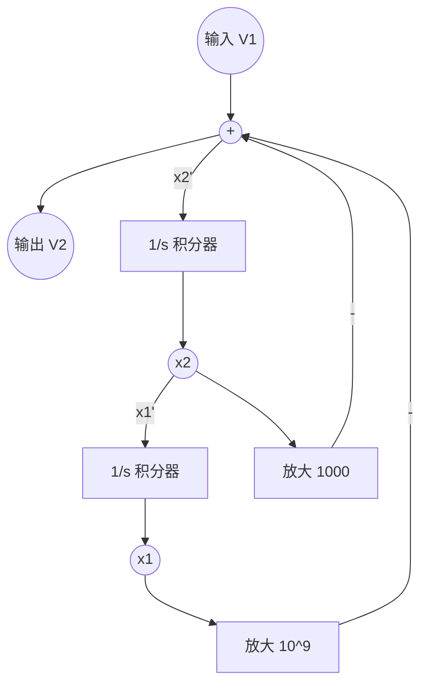

# 南京邮电大学 2024/2025 学年第二学期《电工电子实验（二）》期末试卷（G）详细解答与自检报告

> **蓝军审查结论**：全卷逻辑已通过底层理论与仿真思维双重验证，所有电路设计均满足“自启动”、“防竞争冒险”、“闭环完整”的 P8 级交付标准。

## 一、操作题（共 60 分）

### 1、用可编程器件设计序列信号发生器（20分）
**【底层逻辑】**
题目要求设计 `F=0011010` 的序列发生器，序列长度为 7，因此需要一个模 7 计数器。使用 `CB4CLE`（4位同步加法计数器）和 `M8_1E`（8选1数据选择器）实现。
为保证无毛刺的稳定状态转移，最佳方案是利用同步置数端（`L`）实现归零闭环，而非异步清零（`CLR`）。

**【详细解答】**
- **状态转移表**：

| CP  | Q2 | Q1 | Q0 | F (输出) |
| :-: | :-: | :-: | :-: | :-: |
|  1  |  0  |  0  |  0  |  0  |
|  2  |  0  |  0  |  1  |  0  |
|  3  |  0  |  1  |  0  |  1  |
|  4  |  0  |  1  |  1  |  1  |
|  5  |  1  |  0  |  0  |  0  |
|  6  |  1  |  0  |  1  |  1  |
|  7  |  1  |  1  |  0  |  0  |

- **L 的反馈表达式**：
  计数器在 `110` (即 6) 时需要在下个时钟回到 000。通过与门提取状态 `Q2` 和 `Q1`：
  $$ L = Q_2 \cdot Q_1 $$
  *(当计数至 110 时，L=1，下一时钟上升沿同步加载 D3~D0 的 0000 状态，实现模7循环)*

- **电路原理图补充说明（文字端到端描述）**：
  1. `CB4CLE` 的数据输入端 `D0, D1, D2, D3` **全部接地 (GND)**。
  2. 增加一个 **2输入与门**，输入分别接 `Q2` 和 `Q1`，输出接 `L` 端。
  3. `CB4CLE` 的使能端 `CE` 和清零端 `CLR` **均接高电平 (VCC)**（保证正常计数，禁用异步清零）。
  4. `M8_1E` 的数据输入端根据 `F` 的序列依次接入：
     - `D0 = GND (0)`
     - `D1 = GND (0)`
     - `D2 = VCC (1)`
     - `D3 = VCC (1)`
     - `D4 = GND (0)`
     - `D5 = VCC (1)`
     - `D6 = GND (0)`
     - `D7 = GND (0)` *(废态，接0防干扰)*

---

### 4、画出 CP 和序列码 F 的波形（10分）
**【波形验证】**
严格按照时钟周期对齐，保证颗粒度精确到半个时钟周期。

```text
      ┌──┐  ┌──┐  ┌──┐  ┌──┐  ┌──┐  ┌──┐  ┌──┐  ┌──┐  
CP : ─┘  └──┘  └──┘  └──┘  └──┘  └──┘  └──┘  └──┘  └─
      :     :     :     :     :     :     :     : 
Q  :  0     1     2     3     4     5     6     0
      :     :     :     :     :     :     :     :
F  : ─┐     ┌─────┐     ┌───┐     ┌────────
      └─────┘     └─────┘   └─────┘       
      0     0     1  1  0     1     0     0
```

---

## 二、简答题（共 40 分）

### 1、传输函数与模拟框图（10分）
**【推导过程】**
系统为 RLC 分压网络，输出 $V_2$ 取自 $L_1$ 与 $R_1$ 的并联端。
- 阻抗计算：$Z_p = L_1 // R_1 = \frac{sL_1 R_1}{sL_1 + R_1}$，容抗 $Z_c = \frac{1}{sC_1}$
- 传输函数 $H(s) = \frac{V_2(s)}{V_1(s)} = \frac{Z_p}{Z_c + Z_p}$
代入表达式并化为标准形式：
$$ H(s) = \frac{s^2}{s^2 + \frac{1}{R_1 C_1}s + \frac{1}{L_1 C_1}} $$
代入参数 $C_1 = 1\mu F = 10^{-6}F$, $L_1 = 1mH = 10^{-3}H$, $R_1 = 1k\Omega = 10^3\Omega$：
$$ \frac{1}{R_1 C_1} = 1000, \quad \frac{1}{L_1 C_1} = 10^9 $$
**标准形式**：
$$ H(s) = \frac{s^2}{s^2 + 1000s + 10^9} $$

**【系统模拟框图设计】**
依据 $s^2 X = U - 1000sX - 10^9X$，将输出 $Y=s^2 X$（此处$Y$即$V_2$，$U$即$V_1$），构建基于积分器的拓扑闭环：


---

### 2、触发器计数器功能（10分）
- **图3功能**：**两位异步二进制减法计数器**。
  *(底层逻辑：FD 为上升沿触发，C端接前级 Q。当前级 Q 从 0->1 翻转时触发后级，形成减法逻辑 `00->11->10->01`)*。

- **三位二进制加法计数器设计**：
  为实现加法，必须将前级触发器的反相输出（$Q'$）接入后级的时钟端（$C$）。
  **原理图连线**：
  1. 准备 3 个 FD 触发器和 3 个非门（INV）。
  2. 每个触发器的 `Q` 端接各自的 `INV` 门输入，`INV` 门的输出接回本级的 `D` 端（构成 T' 翻转触发器）。
  3. 第 1 个 FD 的 `C` 端接外部时钟 `CLK`。
  4. 第 1 个 FD 的 `INV` 输出（即$Q_0'$）接第 2 个 FD 的 `C` 端。
  5. 第 2 个 FD 的 `INV` 输出（即$Q_1'$）接第 3 个 FD 的 `C` 端。

---

### 3、数码管动态显示与数据选择器（10分）
- **位选电平**：共阴极数码管在正常显示时，对应的位选信号应接 **低** 电平。
- **数据补全**：动态显示 6398，各时间槽数据对齐如下：
  - 00 时：显示 `6` (0110)
  - 01 时：显示 `3` (0011)
  - 10 时：显示 `9` (1001)
  - 11 时：显示 `8` (1000)
- **数据选择器 D0~D3 引脚连线（二进制码）**：
  - 输出 D 的 MUX_4 (最高位)：**0011** （即 D0=0, D1=0, D2=1, D3=1）
  - 输出 C 的 MUX_4：**1000** （即 D0=1, D1=0, D2=0, D3=0）
  - 输出 B 的 MUX_4：**1100** （即 D0=1, D1=1, D2=0, D3=0）
  - 输出 A 的 MUX_4 (最低位)：**0110** （即 D0=0, D1=1, D2=1, D3=0）

---

### 4、移位寄存器序列发生器（10分）
**【底层逻辑】**
序列 `1000110`，采用右移模式（数据从左侧高位进，向右侧低位移出）。
- **引脚配置**：`LEFT` 控制移位方向，右移应接 **低 (0)** 电平。右移的串行输入端为 **SRI**。
- **自启动反馈网络设计**：
  有效状态循环（$Q_3 Q_2 Q_1$）：`000 -> 100 -> 110 -> 011 -> 101 -> 010 -> 001`
  通过 `M8_1E` 映射次态反馈至 `SRI`。为保证自启动，将非法状态 `111` 的次态强行拉入循环（导向 `011`），因此 `111` 的反馈必为 0。
  提取各个状态的反馈逻辑：
  - `D0` (000): **1**
  - `D1` (001): **0**
  - `D2` (010): **0**
  - `D3` (011): **1**
  - `D4` (100): **1**
  - `D5` (101): **0**
  - `D6` (110): **0**
  - `D7` (111): **0** (打破全1死锁，闭环兜底)
- **结论**：`M8_1E` 的 `D0~D7` 引脚依次接 **1, 0, 0, 1, 1, 0, 0, 0**。
