# 🌐 09-AI_Knowledge_Hub 知识中枢总览

> [!INFO] 知识中枢物理定位
> - **项目物理绝对路径**：`C:\Users\22061\Documents\Obsidian Vault`
> - **Git 仓库地址**：`https://github.com/X-8871/Obsidian.git`

欢迎访问 **AI 跨工具中央知识中枢**。本知识库作为所有 AI 协作工具（Antigravity、Codex、Workbuddy、OpenCode 等）的**单一真理源（Single Source of Truth, SSOT）**与领域知识库，旨在消除上下文割裂，实现跨项目、跨工具的标准化协同。

---

## 🛠️ 如何维护本项目（知识中枢自维护指南）

> [!IMPORTANT]
> **所有接入本知识库的 AI Agent 及人类协作者必须严格遵循以下自维护规范：**

### 1. ➕ 新增文档规范 (Addition Protocol)
- **按类归档**：根据资料性质严格存入对应的子目录（`01-` 至 `04-`），**严禁在根目录下散落未分类文档**。
- **命名规范**：使用清晰具象的中文命名（如 `[项目名]_维护说明.md`、`[主机名]_运维指南.md`）。
- **元数据要求**：新建文档顶部必须具备标准的 YAML Frontmatter 属性。
- **MOC 自动回填（强制）**：创建任何新文档后，**必须立即在本总览页对应的分类下追加一条 `[[文件名]]` 内部双链与一句话简述**，确保知识网无孤岛。

### 2. 📝 修改与更新规范 (Update Protocol)
- **保留架构红线**：修改项目维护手册时，严禁擅自删减“架构红线与禁忌”和历史排坑记录。
- **增量演进**：基础设施变更（如 IP、端口、路径）直接就地更新，并在文档末尾或相关板块注明最新状态。

### 3. 🗄️ 归档与清理规范 (Archive Protocol)
- 已废弃的项目、过期环境或临时性文件，移动至 `05-Archive/`（如有），并在本总览页中移除或标记为已归档。

### 4. 🚫 中枢规范与安全红线 (Redlines)
- **便携双链语法**：文档间的所有跳转必须使用 Obsidian 纯正内部双链 `[[文件名]]`，**严禁使用外部绝对路径 `file:///`**。
- **敏感信息脱敏**：避免在此明文硬编码高危私钥或明文密码，使用环境变数或私钥路径指引代替。

### 5. 🔄 通用资产抽取与解耦协议 (Extraction Protocol)
- **自动剥离通用操作**：在为具体项目生成维护手册时，AI 必须主动识别其中具有通用复用价值的操作（如 Git/GitHub 代理连接、云主机 SSH 免密、Docker 环境初始化等）。
- **沉淀至公共目录**：将通用操作剥离并独立归档至 `02-Infrastructure_Ops/` 或 `04-Workflows_SOP/`。
- **项目端双链引用**：在项目的维护手册中，直接通过 `[[通用文档名]]` 进行轻量化双链引用，杜绝在各个项目文档中大段重复黏贴公共教程。

---

## 📂 模块划分、职责与撰写规范

### 📁 01-Core_Rules（核心准则与跨工具契约）
- **职责定位**：定义所有 AI 必须遵守的“最高宪法”、个人编码习惯与跨工具交接协议。
- **撰写/修改格式**：采用声明式条款、检查清单（`- [ ]`）及 Callout 强调块（`> [!IMPORTANT]`）。
- **当前核心文档**：
  - [[AGENT_CORE]] —— 全局通用行为宪法、语言编码偏好、大型项目时刻更新交接规范与交互底线。
  - [[HANDOFF_PROTOCOL]] —— 跨 AI 工具任务交接标准看板（HANDOFF.md）模板、四大实时触发时机与流转协议。

---

### 📁 02-Infrastructure_Ops（基础设施与运维环境）
- **职责定位**：记录云服务器、数据库、本地主机与网络环境的连接方式、拓扑及一键运维手册。
- **撰写/修改格式**：必须包含四要素：
  1. `连接信息表`（公网/内网 IP、端口、用户、密钥路径说明）；
  2. `常用运维命令`（服务启停、状态查看、日志追踪）；
  3. `核心目录与环境拓扑`（Docker 目录、项目部署根路径）；
  4. `常见网络/排障 Q&A`。
- **当前核心文档**：
  - [[常用开发环境与工具链]] —— 本机硬件配置、开发环境运行时、ESP/FPGA/媒体工具链与避坑档案。
  - [[Git与GitHub连接配置]] —— Git/GitHub SSH 认证、代理网络加速与远程仓库管理。
  - [[Minecraft云服务器连接与运维]] —— Minecraft 生产云主机的脱敏连接流程、目录拓扑、日常命令与网络排障。
  - [[Minecraft_Fabric服务器通用运维指南]] —— Fabric 私服的 SSH/RCON、平滑重启、备份、Chunky、UUID 与常见排障方法。
  - [[云服务器连接与运维_模板]] —— 记录常用云主机连接与运维指南模板。
  - [[低内存Node服务按需激活与原子发布指南]] —— 小内存主机上的 systemd socket 按需激活、Nginx 代理、资源限制、原子 release 与回滚方法。

---

### 📁 03-Project_Runbooks（重点项目专属维护手册）
- **职责定位**：针对独立重要项目的长期维护手册，防止 AI 误改底层架构或遗忘构建命令。
- **撰写/修改格式**：必须采用**四段式标准模板**：
  1. `一、项目物理地址与架构概览`（强制写明**本地绝对物理路径**与**Git仓库地址**、核心依赖版本、目录职责划分）；
  2. `二、运行与部署指令（Runbook）`（启动、打包、测试、发布步骤）；
  3. `三、架构红线与禁忌（Redlines）`（**绝对禁止擅自修改的模块与设计逻辑**）；
  4. `四、故障排查与已知问题记录`（历史踩坑与解决方案）。
- **当前核心文档**：
  - [[Obsidian_知识库运维与维护说明]] —— Obsidian 全库目录治理、命令环境、防孤岛及架构红线规范。
  - [[Minecraft_Fabric私服与AI新闻机器人_维护说明]] —— 当前 Fabric 私服与新闻机器人的生产基线、运行指令、红线和故障记录。
  - [[Mouse_Workbench与Obsidian同步服务_维护说明]] —— Mouse Workbench 本地优先架构、双同步链、腾讯云 Obsidian 服务、生产状态、红线与验收入口。
  - [[重点项目维护说明_模板]] —— 项目运维与维护手册四段式标准模板。

---

### 📁 04-Workflows_SOP（专项标准化作业流程）
- **职责定位**：处理高复杂度、多步骤、重复性任务的标准化操作指南（SOP）。
- **撰写/修改格式**：必须采用**时序化步骤流（Step-by-Step）**：
  1. `输入与前置条件（Inputs）`；
  2. `执行阶段（Phase 1 -> Phase 2 -> Phase 3）`；
  3. `输出物标准与验收清单（Acceptance Checklist）`。
- **当前核心文档**：
  - [[Obsidian课程资料整理SOP]] —— 试卷切图、智能纠偏、长卷组装与双链整理规范。
  - [[大文件清单式原子同步验收SOP]] —— 覆盖 A/B 模式、流式大文件、原子 revision、故障注入、权限与资源验收的通用流程。

---

### 🔒 05-Private_Vault（最高绝密隔离区）
- **职责定位**：记录脱敏凭据指南、本地敏感配置备忘。该目录受 `.gitignore` 保护。
- **安全与授权禁令**：**最高受限门禁**。AI 默认绝对禁止主动读取与输出本目录内容，仅在用户本轮显式输入“`授权访问私密库`”后方可查阅。
- **当前核心文档**：
  - [[私密凭据安全说明与模板]] —— 敏感凭据记录最佳实践与脱敏备忘模板。
  - [[Minecraft云服务器敏感连接信息]] —— Minecraft 生产云主机的实际地址、端口、账户与受限连接命令。

---

## 🧭 快速路由导图 (Quick Navigation Map)

```mermaid
graph TD
    Hub["00-AI知识中枢总览 (MOC)"]
    
    Hub --> R["01-Core_Rules<br/>(核心宪法与交接契约)"]
    Hub --> O["02-Infrastructure_Ops<br/>(服务器与运维环境)"]
    Hub --> P["03-Project_Runbooks<br/>(重点项目维护手册)"]
    Hub --> W["04-Workflows_SOP<br/>(标准化作业流程)"]
    Hub --> V["🔒 05-Private_Vault<br/>(绝密隔离区/门禁受限)"]

    R --> R1["[[AGENT_CORE]]"]
    R --> R2["[[HANDOFF_PROTOCOL]]"]
    O --> O1["[[常用开发环境与工具链]]"]
    O --> O2["[[Git与GitHub连接配置]]"]
    O --> O3["[[云服务器连接与运维_模板]]"]
    O --> O4["[[Minecraft_Fabric服务器通用运维指南]]"]
    O --> O5["[[Minecraft云服务器连接与运维]]"]
    O --> O6["[[低内存Node服务按需激活与原子发布指南]]"]
    P --> P1["[[Obsidian_知识库运维与维护说明]]"]
    P --> P2["[[重点项目维护说明_模板]]"]
    P --> P3["[[Minecraft_Fabric私服与AI新闻机器人_维护说明]]"]
    P --> P4["[[Mouse_Workbench与Obsidian同步服务_维护说明]]"]
    W --> W1["[[Obsidian课程资料整理SOP]]"]
    W --> W2["[[大文件清单式原子同步验收SOP]]"]
    V --> V1["[[私密凭据安全说明与模板]]"]
    V --> V2["[[Minecraft云服务器敏感连接信息]]"]
```

