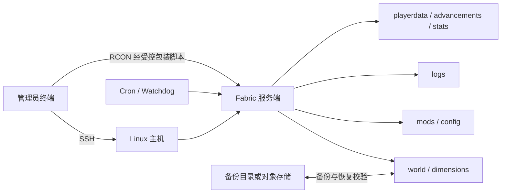

# Minecraft Fabric 服务器通用运维指南

> 适用于运行在 Linux 上、通过 SSH 与 RCON 管理的 Fabric 服务端。本文只保留可跨项目复用的操作；具体主机、世界名称、版本和模组清单应写在各项目维护说明中。

## 一、连接信息表

| 项目 | 推荐记录方式 | 安全要求 |
|---|---|---|
| SSH 主机 | `ssh <ssh-user>@<server-host>` 或 SSH Config 别名 | 不在知识库写私钥、密码或云 API 密钥 |
| SSH 端口 | 默认 `22`，非默认端口写入 SSH Config | 安全组仅开放必要来源 |
| Minecraft 端口 | 默认 `25565/TCP` | 按实际用途配置白名单、防火墙和限速 |
| 语音端口 | 由语音模组决定，通常为独立 UDP 端口 | 不要误配成 TCP |
| 服务端根目录 | `<server-root>` | 世界、配置、日志、模组分目录管理 |
| RCON | 本机回环地址上的包装脚本或受限客户端 | 密码放权限受控配置，不写命令行和文档 |
| 备份目录 | `<backup-root>`，建议独立磁盘或对象存储 | 定期验证可恢复性，不能只验证压缩包存在 |

## 二、常用运维命令

### 2.1 只读状态检查

```bash
# Java 服务端进程
ps -eo pid,etimes,rss,cmd | grep '[f]abric-server-launch.jar'

# 内存、交换分区、磁盘与世界体积
free -h
df -h <server-root>
du -sh <server-root>/world

# 最近日志与异常信号
tail -n 100 <server-root>/logs/latest.log
grep -Ei 'oom|outofmemory|can.t keep up|exception|error' <server-root>/logs/latest.log | tail -n 50
```

判断内存时优先看 `available`，不要只看 `free`。Linux 会把空闲内存用于文件缓存；少量 Swap 使用也不等于正在内存溢出，应结合 `available`、换入换出趋势、GC 和卡顿日志判断。

### 2.2 使用 RCON 查询与控制

```bash
# 包装脚本要求以“-”表示从标准输入读取时
printf 'list\n' | python3 <rcon-wrapper> -
printf 'save-all flush\n' | python3 <rcon-wrapper> -
printf 'stop\n' | python3 <rcon-wrapper> -
```

先执行 `list` 验证链路。若命令无输出，先检查包装脚本是否必须带 `-`，再检查 `enable-rcon`、回环监听、端口与凭据权限。不要把 RCON 密码直接拼进终端命令、Cron 或知识库。

### 2.3 平滑重启

推荐顺序：

1. 用 RCON 通知在线玩家并留出倒计时。
2. 执行 `save-all flush`，再执行 `stop`。
3. 等待 Java 进程正常退出；只有超时后才进入人工处置。
4. 通过既有服务管理器、启动脚本或 `screen` 会话重新启动。
5. 检查进程、`latest.log`、端口和 `list` 输出。

禁止把 `kill -9` 当作日常重启方式。强制结束可能造成区块、玩家数据或 `level.dat` 写入不完整。

### 2.4 备份与恢复前置检查

```bash
# 备份前先保存并停止写入；以下目录按实际 level-name 调整
tar -czf <backup-root>/world-YYYYMMDD-HHMMSS.tar.gz -C <server-root> world
sha256sum <backup-root>/world-YYYYMMDD-HHMMSS.tar.gz
tar -tzf <backup-root>/world-YYYYMMDD-HHMMSS.tar.gz | head
```

恢复前必须再次备份当前状态，并核对游戏版本、Fabric Loader、模组及配置兼容性。恢复玩家问题时，优先精确处理对应 UUID 文件，不要整体覆盖 `playerdata`、`advancements`、`stats` 或世界目录。

### 2.5 Chunky 预生成

```text
chunky world <world-name>
chunky center <x> <z>
chunky radius <radius>
chunky start
chunky progress
chunky pause
chunky continue
```

预生成前确认磁盘余量、备份、世界和中心坐标；运行期间关注 TPS、`available` 内存、Swap、磁盘增长和异常日志。低内存时优先暂停 Chunky 并保存世界，不要直接清理世界文件。

## 三、核心目录与环境拓扑



| 路径 | 职责 | 变更注意事项 |
|---|---|---|
| `<server-root>/server.properties` | 核心服务器参数 | 修改前备份，重启后验证实际生效值 |
| `<server-root>/mods` | 服务端模组 | 版本必须匹配 Minecraft、Loader 与依赖 |
| `<server-root>/config` | 模组配置 | 记录默认值和变更原因 |
| `<server-root>/world` | 主世界及玩家数据 | 停服或冻结写入后再做迁移/恢复 |
| `<server-root>/logs` | 运行与重启日志 | 排障优先查时间线，不只看最后一行 |
| `<backup-root>` | 可恢复备份 | 限权、校验、异地保存、定期演练 |

## 四、常见网络与排障 Q&A

### Q1：`free` 很少，是否说明服务器马上崩溃？

不一定。优先看 `available`，再结合 Swap 持续增长、GC、TPS 和 `Can't keep up` 日志。缓存可被系统回收；真正危险的是可用内存持续下降并伴随换页、卡顿或 OOM。

### Q2：PowerShell 通过 SSH 执行远程命令时，为什么变量或管道失效？

Windows PowerShell 可能先解释 `$()`、`$变量`、引号和管道。短命令可用单引号保护远程表达式；复杂命令应保存为 UTF-8 脚本后上传并执行，避免多层转义。任何包含凭据的命令都不要通过历史记录暴露。

### Q3：为什么向 `screen` 注入命令后没有可靠输出？

`screen -X stuff` 适合简单输入，不适合可靠采集结果，控制台刷屏时尤其明显。查询与自动化优先使用 RCON；启动和人工应急再使用 `screen`。连续命令应串行执行并核验结果。

### Q4：离线模式为什么容易出现玩家背包、位置或末影箱异常？

`online-mode=false` 使用离线 UUID，改名、切换认证模式或迁移启动器可能改变 UUID 映射。排查时关联 `usercache.json`、`whitelist.json`、`world/playerdata`、`advancements`、`stats` 和服务端日志；任何替换前都要停服并做逐文件备份。

### Q5：Cron 明明存在，为什么任务没有按预期执行？

Cron 环境变量和工作目录都比交互式终端少。使用绝对路径、显式 `cd`、日志重定向和服务器实际时区；修改后用 `crontab -l` 复核，并检查脚本执行权限与日志。含 `%` 或复杂命令时优先调用独立脚本。

### Q6：升级 Minecraft、Fabric 或模组的安全顺序是什么？

先建立可恢复备份，再在隔离副本中同时核对 Minecraft、Java、Fabric Loader、Fabric API、模组依赖和配置迁移；完成启动、进服、区块加载、玩家数据与回滚测试后，才安排维护窗口升级生产服。

## 安全边界

- 不记录明文 SSH 私钥、RCON 密码、Webhook、云 API 密钥或模型 API Key。
- 不在玩家在线或世界仍写入时复制、覆盖、删除世界与玩家数据。
- 不用模糊进程匹配直接 `pkill -f`；模式可能匹配命令自身，应先只读确认准确 PID。
- 不把防火墙、白名单和认证模式变更混入普通性能调优。

## 关联文档

- [[Minecraft_Fabric私服与AI新闻机器人_维护说明]]
- [[云服务器连接与运维_模板]]
