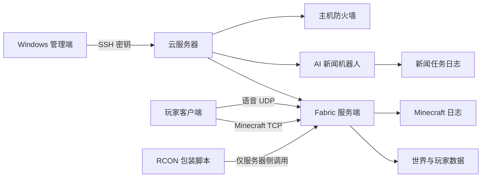

# Minecraft 云服务器连接与运维

> [!INFO] 项目定位
> - **项目物理绝对路径**：`D:\MC\Server`
> - **Git 仓库地址**：`未初始化 Git（暂无远程仓库地址）`

> [!IMPORTANT]
> 本文件可进入普通知识库和 Git，因此不记录公网 IP、真实用户名、密钥路径、RCON 端口或可直接连接生产机的完整命令。实际连接参数存放在受限文档 [[Minecraft云服务器敏感连接信息]]；访问该文档必须取得用户对私密库的明确授权。

## 一、服务器基础连接信息

| 配置项          | 公开记录值                         | 实际值位置                         |
| ------------ | ----------------------------- | ----------------------------- |
| 服务器用途        | Minecraft Fabric 私服与 AI 新闻机器人 | 本文件                           |
| 云平台          | 云主机                           | [[Minecraft云服务器敏感连接信息]]       |
| 公网地址         | `<server-host>`               | [[Minecraft云服务器敏感连接信息]]       |
| SSH 端口       | `<ssh-port>`                  | [[Minecraft云服务器敏感连接信息]]       |
| SSH 用户       | `<ssh-user>`                  | [[Minecraft云服务器敏感连接信息]]       |
| SSH 别名       | `<ssh-alias>`                 | 本地 `~/.ssh/config` 或私密文档      |
| 身份认证         | SSH 密钥                        | 私钥只保存在本机受限目录，不进入 Obsidian/Git |
| Minecraft 端口 | `<minecraft-port>/TCP`        | [[Minecraft云服务器敏感连接信息]]       |
| 语音端口         | `<voice-port>/UDP`            | [[Minecraft云服务器敏感连接信息]]       |
| RCON         | 仅允许经 SSH 在服务器侧调用              | 端口和密码不得写入公开文档                 |

推荐在本机 SSH Config 中维护连接参数：

```sshconfig
Host <ssh-alias>
    HostName <server-host>
    User <ssh-user>
    Port <ssh-port>
    IdentityFile <private-key-path>
    IdentitiesOnly yes
    ServerAliveInterval 30
```

## 二、常用连接与运维命令

### 2.1 Windows PowerShell 连接

```powershell
# 测试 SSH 端口
Test-NetConnection <server-host> -Port <ssh-port>

# 使用 SSH Config 别名登录
ssh -o BatchMode=yes <ssh-alias>

# 上传单个文件到临时目录
scp -p <local-file> <ssh-alias>:/tmp/

# 下载日志到当前目录
scp -p <ssh-alias>:<minecraft-root>/logs/latest.log .
```

PowerShell 会先解释双引号中的 `$变量`、`$()` 和部分特殊字符。简单远程命令优先用单引号保护；复杂操作保存为 UTF-8 脚本，上传后执行并删除临时副本。

### 2.2 服务器与 Minecraft 状态

```powershell
# 进程、内存、磁盘和世界体积
ssh <ssh-alias> 'ps -eo pid,etimes,rss,cmd | grep "[f]abric-server-launch.jar"; free -h; df -h <minecraft-root>; du -sh <minecraft-root>/world'

# 最近日志
ssh <ssh-alias> 'tail -n 100 <minecraft-root>/logs/latest.log'

# 在线玩家；RCON 包装脚本以“-”表示从标准输入读取
ssh <ssh-alias> 'printf "list\n" | python3 <rcon-wrapper> -'

# 核对定时任务
ssh <ssh-alias> 'crontab -l'
```

### 2.3 平滑重启与日志

```powershell
# 调用既有平滑重启脚本
ssh <ssh-alias> '<minecraft-root>/<restart-script>'

# 检查重启结果
ssh <ssh-alias> 'tail -n 100 <minecraft-root>/logs/restart.log; ps -eo pid,etimes,rss,cmd | grep "[f]abric-server-launch.jar"'
```

不要把 `kill -9`、模糊 `pkill -f` 或“强杀后立即启动”作为日常重启方式。完整的保存、备份、Chunky 和 UUID 处理流程见 [[Minecraft_Fabric服务器通用运维指南]]。

### 2.4 AI 新闻机器人

```powershell
# 查看定时任务日志
ssh <ssh-alias> 'tail -n 100 <news-root>/logs/cron.log'

# 先执行无推送验证
ssh <ssh-alias> 'cd <news-root> && python3 daily_news_digest.py --offline'
```

用户当前要求暂不使用 DeepSeek 和千问；在得到新授权前，不得通过连接操作重新启用相关模型配置。

## 三、核心目录与环境拓扑



| 逻辑路径 | 用途 | 变更边界 |
|---|---|---|
| `<minecraft-root>` | Minecraft 服务端根目录 | 实际路径见私密文档 |
| `<minecraft-root>/world` | 世界及玩家数据 | 停服/冻结写入并备份后才能迁移 |
| `<minecraft-root>/mods` | Fabric 模组 | 升级前验证版本与依赖矩阵 |
| `<minecraft-root>/config` | 模组配置 | 修改前保存差异与回滚副本 |
| `<minecraft-root>/logs` | 服务端及重启日志 | 排障以日志时间线为准 |
| `<news-root>` | AI 新闻机器人 | 配置文件不得进入 Git 或日志 |
| 本机 `~/.ssh` | SSH Config、私钥、known_hosts | 仅限本机账户访问 |

## 四、常见网络与排障 Q&A

### Q1：SSH 超时怎么办？

先执行 `Test-NetConnection` 区分 DNS/路由与认证问题，再检查云平台防火墙、主机防火墙、SSH 服务和本地网络。不要为了排障临时向全网开放所有端口。

### Q2：出现 `Permission denied (publickey)` 怎么办？

用 `ssh -G <ssh-alias>` 查看最终生效的用户、端口和 `identityfile`，确认公钥已写入远端目标用户的 `authorized_keys`。禁止把私钥上传到服务器或知识库。

### Q3：首次连接出现主机指纹提示怎么办？

应通过云平台控制台或可信渠道核对主机指纹后再接受。若主机未重装却突然变更指纹，应停止连接并调查，不能直接删除 `known_hosts` 后忽略告警。

### Q4：SSH 正常但 Minecraft 无法加入怎么办？

依次检查 Java 进程、`latest.log`、TCP 监听、云平台入站规则、主机防火墙、白名单、客户端版本和模组集合。语音聊天另查 UDP 端口，不能用 TCP 连通性代替验证。

### Q5：为什么不直接从公网连接 RCON？

RCON 不应作为公网管理面。即使设置密码，也应由云防火墙和主机防火墙阻断公网入口，只通过 SSH 登录服务器后调用受控包装脚本。若发现 RCON 监听所有网卡，应立即核对外部可达性并补充显式防火墙限制。

### Q6：怎样确认操作的是正确服务器？

登录后先核对 `hostname`、操作系统、服务端根目录和 Java 进程，再执行变更。破坏性操作必须使用绝对路径，并先以只读命令确认目标。

## 关联文档

- [[Minecraft云服务器敏感连接信息]]
- [[Minecraft_Fabric服务器通用运维指南]]
- [[Minecraft_Fabric私服与AI新闻机器人_维护说明]]
- [[Git与GitHub连接配置]]
