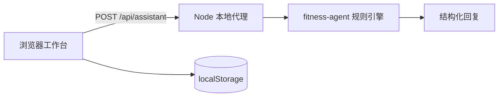

# Lzheng Fitness Web 维护说明

> [!INFO] 项目定位
> - **项目物理绝对路径**：`C:\Users\22061\Desktop\Person_WorkBeach\apps\fitness`
> - **统一 Git 仓库地址**：`https://github.com/X-8871/Person_WorkBeach.git`
> - **历史来源**：原本地仓库 `C:\Users\22061\Desktop\Person_workdesk\02_Fitness`，源提交历史已导入统一仓库
> - **当前版本**：`0.1.0`（项目内的 Lzheng Fitness 包版本为 `2.3.1`）
> - **历史源提交**：`da582fd feat: redesign fitness workbench`

> [!IMPORTANT]
> 这是一个以 `Lzheng Fitness Skills v2.3.1` 为知识与流程核心的本地个人健身工作台。当前由本地规则代理提供服务，不需要 API Key；后续接入真实 AI Provider 时，应只替换服务端代理，不改变前端流程和安全边界。

## 一、项目物理地址与架构概览

### 1.1 产品定位与当前能力

网页把个人健身流程组织成一条闭环：**基础建档 → 第一周训练框架 → 今日动作勾选 → 训练复盘 → 下一次建议 → 本地记录**。

当前已支持：

- 根据目标、训练经验、每周频率、单次时长、器械与限制生成第一周训练框架；
- 使用保留余力的校准规则，不猜测用户的具体训练重量；
- 今日训练动作勾选与完成度记录；
- 本地代理教练问答、下一步提示与安全分流；
- 训练复盘，记录完成度、主观用力、疼痛与备注；
- 对锐痛、麻木、放射痛、胸部不适、晕厥、异常气短等红旗信号停止常规高强度建议；
- 在浏览器 `localStorage` 保存档案、计划、对话和训练记录；服务端不持久化私人训练数据。

当前网页不是医疗诊断工具，也不是完整的 Lzheng 专业 Skill 执行环境。

### 1.2 技术栈与目录职责

| 维度 | 当前选型 |
| :--- | :--- |
| 编程语言与运行时 | 原生 HTML/CSS/ES Modules + Node.js 20+ |
| 运行依赖 | 零第三方运行依赖，使用 Node 内置 HTTP 服务 |
| 前端入口 | `public/index.html`、`public/styles.css`、`public/app.js` |
| 服务端代理 | `server.mjs`：静态文件、健康检查、系统信息、教练请求路由 |
| 规则引擎 | `server/fitness-agent.mjs`：建档、计划、对话、复盘与安全分流 |
| 测试 | `tests/`：规则、安全、输入校验、静态路由与代理接口 |
| 包数据 | `public/data/lzheng-fitness.manifest.json`：7 个 Skill 元数据 |
| 视觉资产 | `public/assets/workbench-background.png`；本地托管 `LXGW WenKai Screen` 字体 |
| 产品/设计记录 | `PRODUCT.md`、`DESIGN.md`、`docs/plans/2026-08-25-fitness-web-design.md` |

核心目录：

```text
fitness/
├── public/                         # 网页、样式、交互与同步后的包数据
│   ├── index.html                  # 单页工作台结构
│   ├── styles.css                  # 视觉、响应式与无障碍样式
│   ├── app.js                      # 浏览器状态、页面流程与 API 调用
│   ├── assets/                     # 底层背景图与字体
│   └── data/                       # Lzheng manifest 与素材说明
├── server/                         # 本地代理规则引擎
├── tests/                          # Node 内置测试
├── docs/plans/                     # 产品设计与实施记录
├── server.mjs                      # 零依赖 HTTP 服务入口
├── PRODUCT.md                      # 产品基线
├── DESIGN.md                       # 视觉基线
└── Lzheng-fitness-main.zip         # 原始技能包，仅作本地参考，不写回、不提交
```

### 1.3 Lzheng 包能力映射

原始 manifest 中共记录 7 个 Skill：

- `lzheng-fitness-plan`：完整训练计划与建档流程；
- `lzheng-training-return`：训练后回报与反馈收集；
- `lzheng-strength-cycle-planner`：力量周期规划；
- `lzheng-strength-training-review`：训练复盘与下一次处方；
- `lzheng-training-expert-library`：专家知识边界；
- `lzheng-training-system`：训练系统级能力，非独立入口；
- `lzheng-fitness-workbench-builder`：把计划、复盘与状态组装为工作台，非独立入口。

网页第一版优先落地建档、执行、复盘和安全分流；周期化力量规划与专家库目前保留为能力地图和后续接入边界。

### 1.4 数据流与接口契约



前端统一调用 `POST /api/assistant`，请求动作包括：`onboard`、`chat`、`review`。响应至少保持以下字段：

```json
{
  "safety": "normal",
  "reply": "代理回复",
  "plan": null,
  "nextAction": "下一步"
}
```

## 二、运行与部署指令（Runbook）

### 2.1 本地启动

```powershell
Set-Location 'C:\Users\22061\Desktop\Person_WorkBeach\apps\fitness'
npm start
```

打开：`http://127.0.0.1:4173`

默认端口可通过环境变量 `FITNESS_PORT` 覆盖：

```powershell
$env:FITNESS_PORT = "4174"
npm start
```

### 2.2 语法检查与测试

```powershell
Set-Location 'C:\Users\22061\Desktop\Person_WorkBeach\apps\fitness'
npm run check
npm test
```

当前验收结果：语法检查通过；Node 内置测试 `9/9` 通过。

### 2.3 主要接口

| 方法 | 路径 | 用途 |
| :--- | :--- | :--- |
| `GET` | `/api/health` | 检查本地服务是否可用 |
| `GET` | `/api/system` | 查看代理状态与 7 个 Skill 元数据，不返回密钥 |
| `POST` | `/api/assistant` | 执行建档、对话、复盘与安全分流 |
| `GET` | `/` | 返回网页入口 |

### 2.4 后续 API Key 接入

后续接入真实模型时，在 `server.mjs` 或独立的服务端 Provider 适配器中读取环境变量，保留 `/api/assistant` 的请求与响应契约，并增加超时、速率限制和结构化输出校验。API Key 禁止出现在 `public/`、URL、`localStorage`、Obsidian 文档和 Git 提交中。

## 三、架构红线与禁忌

> [!CAUTION]
> 以下约束用于保护当前项目的安全边界、数据隐私和后续可替换性；除非得到用户明确指示，不要擅自改变。

1. **API Key 只能在服务端环境变量中**：不得放入前端脚本、HTML、URL、浏览器存储、Obsidian 或 Git。
2. **保留 `/api/assistant` 契约**：真实 Provider 只能替换服务端实现，不能让前端分别直连不同模型接口。
3. **安全信号优先于训练推进**：锐痛、麻木、放射痛、胸部不适、晕厥、异常气短等信号必须返回 `safety: "stop"`，不得继续给高强度训练建议；必要时提示停止并寻求专业评估。
4. **不猜测训练重量**：没有可靠历史记录时，继续使用可控起点与保留余力规则，让用户通过实际反馈校准。
5. **不要把用户内容作为 HTML 执行**：聊天、备注等输入继续使用文本节点渲染，避免引入不必要的 HTML 注入风险。
6. **不修改原始技能包内容**：`Lzheng-fitness-main.zip` 与包内授权边界保持不变；网页只同步 manifest 和授权背景素材。
7. **保留本地优先的数据边界**：当前档案、计划、对话与训练日志只存于当前浏览器；若未来增加云端同步，必须另行设计授权、删除和隐私策略。

## 四、故障排查与已知问题记录

| 典型问题 / 状态 | 原因 | 标准排查与恢复手段 |
| :--- | :--- | :--- |
| `http://127.0.0.1:4173` 打不开 | 本地 Node 服务未启动或端口被占用 | 在项目目录运行 `npm start`；如端口占用，设置 `FITNESS_PORT` 使用其他端口 |
| 刷新后看不到刚才的记录 | 浏览器站点数据被清理，或切换了端口/浏览器 | 检查当前是否仍在同一浏览器与端口；项目不会从服务端恢复本地记录 |
| 页面显示“本地代理” | 当前尚未接入真实 AI Provider | 这是预期状态；后续只在服务端增加 Provider 与环境变量，不改前端调用入口 |
| 出现红旗症状后没有训练推进 | 安全分流已触发 `stop` | 先停止高强度训练，必要时寻求专业评估；不要通过改前端文案绕过安全阻断 |
| 动作提示仍不够详细 | 当前动作条目主要提供组次、次数和一句执行提示 | 后续补充动作步骤、呼吸节奏、常见错误、疼痛停止条件、替代动作与示范媒体，并保持安全提示优先 |
| 旧工作区路径仍被某个窗口引用 | 项目已并入 Person WorkBeach 单仓库 | 以 `C:\Users\22061\Desktop\Person_WorkBeach\apps\fitness` 为唯一当前代码路径；重新从该目录启动服务 |

### 当前接手状态

- [x] 本地网页工作台已完成视觉重设计：人物图固定在全站底层，上层使用半透明暖白表面；
- [x] 建档、首周计划、今日训练、动作勾选、教练对话、训练复盘、记录与安全分流均可本地演示；
- [x] 语法检查通过，9 项自动化测试通过；
- [ ] 补充可展开的动作级执行指导与示范媒体；
- [ ] 设计服务端真实 Provider 适配器、API Key 环境变量、超时/限流/输出校验；
- [ ] 接入真实 API Key 后重新做一轮桌面端与移动端浏览器验收。

## 🔗 相关 Obsidian 文档

- 训练内容基线：项目内 `PRODUCT.md` 与 `Lzheng-fitness-main.zip`（原始技能包只读）
- 知识中枢总览：[[00-AI知识中枢总览]]
- 项目维护手册模板：[[重点项目维护说明_模板]]
- 跨工具交接协议：[[HANDOFF_PROTOCOL]]
- 统一项目总手册：[[Person_WorkBeach统一工作台_维护说明]]
