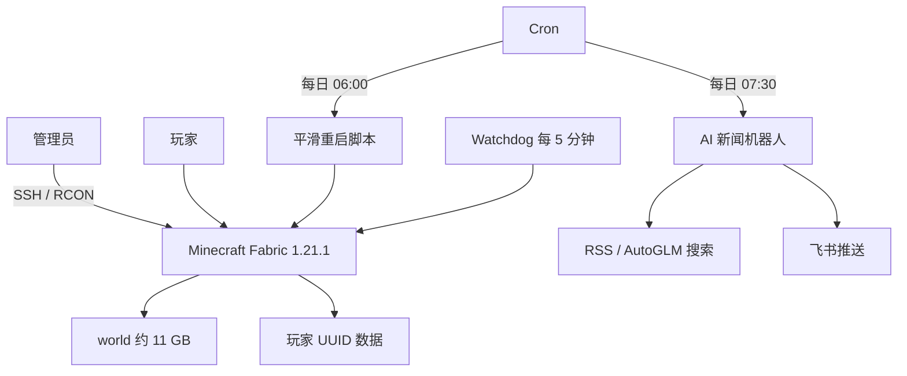

# Minecraft Fabric 私服与 AI 新闻机器人维护说明

> 本文记录当前项目的生产现状、源码职责和项目专属约束。通用 Minecraft 运维方法统一引用 [[Minecraft_Fabric服务器通用运维指南]]，避免在项目手册中重复维护教程。

## 一、技术栈与架构概览

### 1.1 项目边界

当前项目由两个共享同一台 Linux 云主机、但运行链路彼此独立的子系统组成：

1. **Minecraft Fabric 私服**：Java 21、Minecraft 1.21.1、Fabric Loader，主目录为 `/home/ubuntu/minecraft`。
2. **AI 新闻机器人**：Python 3.8+ 标准库脚本，主目录为 `/home/ubuntu/daily_news_digest`，负责采集、分类、摘要、飞书卡片生成和推送。



### 1.2 Minecraft 当前生产基线

| 项目 | 当前值（2026-08-26 核验） |
|---|---|
| 系统与资源 | Ubuntu 22.04，2 核 CPU、约 2 GiB 内存、2 GiB Swap、40 GB 系统盘 |
| Java 与服务端 | Java 21，Fabric 1.21.1，JVM `-Xms1G -Xmx1G` |
| 世界 | `level-name=world`，体积约 11 GB |
| 玩家策略 | `max-players=5`、白名单开启、`online-mode=false` |
| 性能参数 | `view-distance=4`、`simulation-distance=3` |
| 运维计划 | 每日 06:00 平滑重启；每 5 分钟 Watchdog；开机恢复防火墙规则 |
| Chunky | 中心 X=15、Z=-921、半径 3000 的预生成已完成，共 142129 区块 |

生产模组共 10 个：Fabric API、Fabric Language Kotlin、Lithium、Krypton、FerriteCore、Chunky、Simple Voice Chat、Architectury API、FTB Library、FTB Ultimine。升级时必须把依赖模组视为同一兼容性集合。

### 1.3 新闻机器人源码职责

入口文件为 `daily_news_digest.py`，当前仅依赖 Python 标准库。主要调用链如下：

```text
main
├─ run_offline        # 只读本地缓存并渲染结果
├─ run_dry            # 抓取与生成，但不正式推送
├─ run_test_push      # 测试飞书链路
└─ run_normal
   ├─ collect_and_classify
   │  ├─ parse_rss
   │  ├─ autoglm_search
   │  └─ classify_item
   ├─ attach_summaries
   │  └─ deepseek_summarize / fallback
   ├─ build_feishu_card
   └─ send_feishu
```

可用模式为 `--offline`、`--dry-run`、`--test-push`。异常提醒通过 `write_pending_alert` 和 `read_and_clear_pending_alert` 暂存，避免一次推送失败丢失告警。

## 二、运行与部署指令（Runbook）

### 2.1 Minecraft 日常检查

```bash
ssh ubuntu@<server-host>
ps -eo pid,etimes,rss,cmd | grep '[f]abric-server-launch.jar'
free -h
df -h /home/ubuntu/minecraft
tail -n 100 /home/ubuntu/minecraft/logs/latest.log
printf 'list\n' | python3 /home/ubuntu/minecraft/rcon.py -
```

完整的状态判读、备份、Chunky、UUID 和安全重启流程见 [[Minecraft_Fabric服务器通用运维指南]]。

### 2.2 Minecraft 平滑重启与定时任务核验

```bash
/home/ubuntu/minecraft/weekly_restart.sh
crontab -l
tail -n 100 /home/ubuntu/minecraft/logs/restart.log
```

当前 Cron 基线：

| 时间 | 任务 |
|---|---|
| 每日 06:00 | Minecraft 平滑重启 |
| 每日 07:30 | AI 新闻摘要任务 |
| 每 5 分钟 | Minecraft Watchdog |
| 主机启动时 | 恢复防火墙规则 |

脚本名称仍为 `weekly_restart.sh`，但实际调度已经是每日执行。后续可在维护窗口改名并同步 Cron；在完成引用核对前不要只改文件名。

### 2.3 新闻机器人验证顺序

```bash
cd /home/ubuntu/daily_news_digest
python3 daily_news_digest.py --offline
python3 daily_news_digest.py --dry-run
python3 daily_news_digest.py --test-push
```

验证顺序必须从无网络/无推送模式逐步扩大影响。正式运行前检查：

1. `config.json` 能被 JSON 解析，且不把密钥输出到日志。
2. RSS 与搜索源至少有一路可用。
3. 分类数量、摘要回退和飞书卡片体积符合预期。
4. `logs/cron.log` 没有连续失败或重复推送。

### 2.4 修改与发布步骤

1. 先核对本地工作区、生产脚本和配置差异，禁止直接覆盖生产配置。
2. 修改 Python 源码后至少执行语法编译检查和 `--offline`；联网路径再执行 `--dry-run`。
3. 修改 Minecraft 配置或模组前备份相关配置和世界，核对版本兼容矩阵。
4. 上传到临时路径，比较哈希或差异后再原子替换。
5. 使用平滑重启或独立脚本生效，并验证进程、日志、端口和玩家列表。
6. 在项目维护说明和故障记录中同步写明变更原因、回滚点和验证结果。

## 三、架构红线与禁忌（Redlines）

### 3.1 人工核心红线状态

用户本次提供的两条内容是方括号示例占位符，并非可执行红线。因此当前**没有新增具名的人工核心红线**；待用户给出真实条目后，应原样补入本节，AI 不得自行改写其约束强度。

### 3.2 已确认的项目红线

1. **禁止无备份修改世界与玩家数据**：不得直接删除、整体覆盖或批量改写 `world`、`playerdata`、`advancements`、`stats`、`level.dat`。
2. **禁止擅自改变认证与 UUID 规则**：`online-mode`、玩家名和 UUID 映射关系牵涉背包、位置、末影箱及进度；任何切换必须先做映射审计和可回滚迁移。
3. **禁止无兼容性验证升级底层版本**：Minecraft、Java、Fabric Loader、Fabric API 与模组依赖必须在世界副本中成组验证，不能在生产服直接试升级。
4. **禁止把强杀作为正常停服方式**：优先 RCON 保存并 `stop`；只有正常退出超时且完成证据留存后，才允许人工处置进程。
5. **禁止泄露凭据**：SSH 私钥、RCON 密码、腾讯云密钥、飞书 Webhook/签名密钥和模型 API Key 不得出现在知识库、Git、命令行参数或日志中。现有旧文档曾出现明文凭据，必须按已泄露处理并轮换。
6. **禁止擅自恢复 DeepSeek 或千问**：用户已明确暂不使用这两类模型。源码中虽然保留 DeepSeek 摘要分支，但在用户再次明确授权前不得启用或新增千问链路。
7. **禁止把通用教程复制回项目手册**：跨项目运维知识统一维护在 [[Minecraft_Fabric服务器通用运维指南]]；本手册只记录项目差异、红线和历史。

### 3.3 AI 推断出的设计约束

以下不是用户口述红线，但修改前应显式确认：新闻机器人当前采用“Python 标准库单文件主程序 + JSON 配置”的低依赖结构；若引入框架、数据库、消息队列或拆分服务，会改变部署、故障面和回滚方式，应先获得用户同意并另行设计。

## 四、故障排查与已知问题记录

| 现象/问题 | 原因或判断 | 处理方式 | 状态 |
|---|---|---|---|
| 旧文档仍写 Chunky 运行中 | 历史状态未同步 | 以本手册核验值为准；预生成已完成 | 已确认 |
| 旧文档写模拟距离 4、模组 7 个或每周/04:00 重启 | 配置多次调整后记录过期 | 当前为模拟距离 3、模组 10 个、每日 06:00 重启 | 已确认 |
| RCON 命令无输出 | 本项目 `rcon.py` 需要 `-` 才从标准输入读取 | 使用 `printf 'list\n' \| python3 .../rcon.py -` | 已解决 |
| PowerShell 经 SSH 的 `$()`、变量或管道异常 | 本地 shell 抢先解释多层引号 | 简单命令用单引号保护；复杂逻辑上传 UTF-8 脚本 | 已知 |
| `screen -X stuff` 难以确认执行结果 | 控制台刷屏、注入与输出采集不可靠 | 查询和控制优先用 RCON，`screen` 只承担启动/人工应急 | 已知 |
| `Dawn_hope` 与 `WBLANGOI` 出现背包、位置混用迹象 | 离线模式 UUID、旧存档 UUID 或数据文件映射可能不一致 | 停服后对照日志、缓存和玩家数据逐 UUID 审计；替换前逐文件备份 | 待专项复核 |
| 本地新闻机器人 `config.json` 无法解析 | 当前本地副本存在格式/编码异常 | 不复制到生产；先建立脱敏模板，再逐字段重建并执行 `--offline` | 已知 |
| 源码仍含 DeepSeek 摘要分支 | 用户策略已变更但代码尚未移除 | 保持禁用；是否改造为纯回退摘要需用户另行决定 | 待决策 |
| 旧项目文档含明文凭据 | 历史记录未脱敏 | 轮换相关密钥，清理 Git 历史与文档，改用环境变量或权限受控配置 | 高优先级 |
| Simple Voice Chat 离线认证警告 | 与 `online-mode=false` 的信任模型有关 | 确认仅白名单使用，评估语音加密与身份风险，不在未验证时放宽访问 | 已知 |
| 内存 `free` 很少但服务仍运行 | Linux 文件缓存占用；应看 `available` | 结合 Swap、GC、TPS、日志和在线人数判断；日常 06:00 重启仅是缓解手段 | 已知 |

### 后续维护清单

- [ ] 用户补充真实的人工核心红线后，原样写入 3.1。
- [ ] 轮换旧文档中暴露过的云、飞书、RCON 和模型凭据，并清理历史。
- [ ] 对 `Dawn_hope` / `WBLANGOI` 的 UUID 与玩家数据做停服专项核验。
- [ ] 决定新闻机器人的摘要路径：仅本地回退，或采用用户明确批准的新模型。
- [ ] 清理项目旧文档中的 Chunky、模组数、视距和重启时间过期信息。

## 关联文档

- [[Minecraft云服务器连接与运维]]
- [[Minecraft_Fabric服务器通用运维指南]]
- [[Git与GitHub连接配置]]
- [[HANDOFF_PROTOCOL]]
