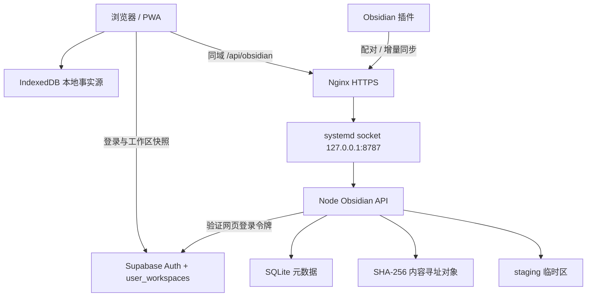

# Mouse Workbench 与 Obsidian 同步服务维护说明

> [!INFO] 项目定位
> - **项目物理绝对路径**：`C:/Users/22061/Desktop/Project/nothing`
> - **Git 仓库地址**：`https://github.com/X-8871/mousewong-personal-web.git`

> [!IMPORTANT]
> 任何 AI 在修改本项目的本地数据模型、账号同步、Obsidian 同步协议或生产部署前，必须通读本手册，并严格遵守第三节红线。通用发布与按需激活方法引用 [[低内存Node服务按需激活与原子发布指南]]，端到端同步验收引用 [[大文件清单式原子同步验收SOP]]。

## 一、技术栈与架构概览

### 1.1 项目定位与技术基线

Mouse Workbench 是一个本地优先的个人工作台，覆盖项目、任务、习惯、日记、日历、闪念、知识库、词汇与只读 Obsidian 浏览。当前源码根目录为 `C:/Users/22061/Desktop/Project/nothing`，主分支为 `main`。

| 层级 | 当前技术与职责 |
|---|---|
| Web / PWA | React 18、TypeScript 5.5、Vite 5、MUI 5、Zustand、React Router 6、vite-plugin-pwa |
| 本地数据 | IndexedDB（`idb`），作为工作台业务数据的本地事实源 |
| 账号与工作区同步 | Supabase Auth + `user_workspaces` JSON 快照、revision 乐观并发控制和 Realtime 通知 |
| Obsidian 网页同步 | 浏览器分块 SHA-256、清单差异、顺序流式上传、字节级进度、A/B 两种模式 |
| Obsidian 服务端 | Node.js 20、Fastify 4、SQLite、内容寻址对象存储、原子 revision 提交 |
| Obsidian 插件 | Obsidian API 1.8、TypeScript、esbuild，支持配对、增量同步和完整重建 |
| 移动端 | Capacitor 6 / Android，Web 产物目录为 `dist/static` |
| 生产入口 | HTTPS Nginx；Obsidian API 仅监听 `127.0.0.1:8787` 并由 systemd socket 按需激活 |

### 1.2 数据边界与调用关系



必须区分两条同步链：

1. **工作台业务数据**：IndexedDB 是本地事实源，Supabase `user_workspaces` 保存快照；冲突由用户选择“使用云端”或“使用本地”，不能静默覆盖。
2. **Obsidian Vault 数据**：Supabase 只验证用户身份；新 Vault 元数据、文件对象、设备和同步记录存入腾讯云本地 API。旧 Supabase Obsidian 表、桶和 Edge Function 只作为回退保留。

### 1.3 核心目录职责

```text
nothing/
├── src/db/                         # IndexedDB schema 与 repositories
├── src/stores/                     # Zustand 状态与业务写入编排
├── src/services/                   # 备份、快照、递归、Obsidian 同步与渲染逻辑
├── src/features/                   # 各业务页面
├── src/components/obsidian/        # Markdown、Canvas、附件等只读查看器
├── server/obsidian-api/            # 腾讯云轻量 API、SQLite、对象存储与部署单元
├── obsidian-plugin/                # Obsidian 增量同步插件源码
├── supabase/                       # 现有 migration 与旧 Edge Function，禁止擅删
├── android/                        # Capacitor Android 工程
├── docs/plans/ 与 docs/handoffs/  # 架构决策、实施计划和历史交接
└── dist/static/                    # 生成的 Web/PWA 产物，不作为源码提交
```

### 1.4 Obsidian 同步不变量

- **A 模式（覆盖）**：服务端以本次完整 manifest 计算缺失项；提交成功后正式文件集合与客户端选择完全一致。
- **B 模式（新建）**：创建独立 Vault；重名时客户端用 UTC+8 时间戳生成唯一名称。
- 默认排除 `.obsidian`、`.trash`、`.git`；单文件上限 256 MiB；浏览器和插件均按顺序一次上传一个文件。
- 小文本可批量传输；大文本和二进制通过原始 PUT 流式进入 staging。服务端重新校验真实字节数和 SHA-256。
- begin、upload、confirm、commit 组成原子流程；失败或未提交 run 不能改变上一正式 revision。
- 物理对象路径只由服务端用户 ID 与 SHA-256 派生；客户端的用户 ID、物理路径、removed、大小和哈希都不可信。
- Signed download URL 默认 10 分钟；配对码为一次性 8 位码、默认 10 分钟；设备令牌只保存摘要。

### 1.5 当前生产状态（2026-08-27 16:18，UTC+8）

| 项目 | 当前状态 |
|---|---|
| Web 前端 | 已部署到 `/var/www/workbench`，生产域名为 `workbench.spectator0618.online`；资源加载修复提交 `37ae82c` 已上线 |
| Obsidian API release | `/opt/mouse-workbench/obsidian-api/releases/20260826-201030`，由 `current` 软链接指向 |
| API 运行状态 | `obsidian-api.socket` 按需监听；最近请求完成后 service 回到 inactive；公开 `/api/obsidian/health` 返回 200 |
| Nginx | active，未停止，继续承载网站和其他现有路由 |
| Obsidian 数据目录 | `/srv/mouse-workbench/obsidian`；安全验收 Vault 为 5 个文件、revision 2，真实 Vault 尚未上传 |
| 生产验收 | Task 1～14 已完成；Task 15 的 B/A 安全夹具、登录、渲染和签名资源已通过；真实 Vault、插件、移动端和回滚仍待完成 |
| Supabase 旧资源 | 继续保留，未删除、未清空、未迁移清理 |
| 当前源码基线 | 代码修复提交 `37ae82c`，交接记录提交 `78f7084`；前端 192 项测试、后端 37 项测试通过，前端构建成功 |

## 二、运行与部署指令（Runbook）

### 2.1 本地开发与验证

```powershell
Set-Location 'C:/Users/22061/Desktop/Project/nothing'

# 主前端
npm ci
npm run dev
npm test
npm run build

# Obsidian API
npm --prefix server/obsidian-api ci
npm --prefix server/obsidian-api test
npm --prefix server/obsidian-api run build

# Obsidian 插件
npm --prefix obsidian-plugin ci
npm --prefix obsidian-plugin run build

# 差异与工作区核对
git diff --check
git status --short
```

当前测试基线：主项目 16 个测试文件、192 项测试；后端 9 个测试文件、37 项测试。插件只有构建脚本，没有独立测试脚本。主构建存在既有的 `chunk larger than 500 kB` 警告，但构建成功。

### 2.2 环境变量与敏感边界

本地从 `.env.example` 创建 `.env.local`，只允许浏览器公开配置：

```dotenv
VITE_SUPABASE_URL=https://your-project.supabase.co
VITE_SUPABASE_PUBLISHABLE_KEY=replace-with-publishable-key
VITE_OBSIDIAN_API_BASE=/api/obsidian
```

服务端环境文件位于 `/etc/mouse-workbench/obsidian-api.env`，权限必须为 `600`，仅由 root 管理。不得在文档、Git、日志或聊天中打印真实密钥。前端禁止使用 Supabase service role。

> [!WARNING]
> `exportBackup()` 当前会导出全部 IndexedDB stores，源码明确说明其中包含 `agentApiKey`。导出的工作台备份必须按敏感文件处理，不得上传公共仓库或粘贴到普通知识笔记。

### 2.3 恢复与暂停 Obsidian API

当前 API 为人工暂停状态。下一次验收前只恢复 socket，不把 service 设为常驻：

```bash
ssh ubuntu@<server-host>
sudo systemctl start obsidian-api.socket
systemctl is-active obsidian-api.socket
systemctl is-active obsidian-api.service || true
curl --fail http://127.0.0.1:8787/health
```

健康请求会按需启动 service。请求与上传全部结束约 2 分钟后，service 应回到 inactive，socket 应保持 active。暂停时执行：

```bash
sudo systemctl stop obsidian-api.socket obsidian-api.service
systemctl is-active obsidian-api.socket || true
systemctl is-active obsidian-api.service || true
ss -ltn '( sport = :8787 )'
```

常用日志与资源检查：

```bash
journalctl -u obsidian-api.service -n 100 --no-pager
systemctl show obsidian-api.service -p MemoryCurrent -p MemoryHigh -p MemoryMax
df -h /srv/mouse-workbench/obsidian
sudo du -sh /srv/mouse-workbench/obsidian
```

通用判断与发布步骤详见 [[低内存Node服务按需激活与原子发布指南]]。

### 2.4 Web、后端与插件发布

1. 发布前先完成主项目、后端和插件的测试/构建，并执行 `git diff --check`。
2. 后端上传到带 UTC+8 时间戳的新 release 目录，安装生产依赖并构建；核对哈希后再原子切换 `current` 软链接。
3. 修改 Nginx 前备份 `/etc/nginx/sites-available/workbench`；必须先 `sudo nginx -t`，成功后只能 reload Nginx。
4. Web 发布前把 `/var/www/workbench` 备份为同级时间戳目录；上传 `dist/static` 后比较本地、远端和公网入口哈希。
5. 插件产物为 `main.js`、`manifest.json` 和样式文件。未经用户明确指定 Vault 路径，不得自动写入 `.obsidian/plugins/`。
6. PWA 更新后若仍命中旧缓存，先核对 `sw.js` 的 `Cache-Control: no-cache`，再让用户执行一次强制刷新。

### 2.5 回滚顺序

1. **后端异常**：把 `current` 软链接切回上一 release，仅重启 `obsidian-api.service` 或恢复 socket。
2. **Nginx 异常**：恢复部署前的站点配置，`nginx -t` 成功后 reload。
3. **Web 异常**：恢复 `/var/www/workbench-backup-<时间戳>`。
4. **同步异常**：保留上一正式 revision，禁止手工拼接半成品 staging 为正式数据。
5. **Supabase 回退**：旧 Obsidian 表、桶和 Edge Function 保留至少一个完整验收周期；清理必须由用户另行明确授权并制定可恢复方案。

### 2.6 Task 15 生产验收入口

下一次维护窗口恢复 socket 后，严格执行 [[大文件清单式原子同步验收SOP]]，并补齐以下项目专属结果：

- [x] B 模式安全夹具上传 5 个文件，已验证登录、Markdown、Wiki Link、图片、Mermaid、Canvas、纯文本。
- [ ] A 模式覆盖真实 Vault，记录文件数、逻辑总字节、上传字节与 revision；当前待用户确认上传非私密范围。
- [x] A 模式安全夹具验证修改 1、增加 2、删除 2、未变化 2，revision 2 提交成功，缺失 Wiki Link 显示断链提示。
- [ ] 使用约 47 MiB 代表文件验证连续字节进度、未知二进制元信息与下载。
- [ ] 验证 Markdown、Wiki Link、图片、Mermaid、Canvas、Excalidraw、Markmap、PDF、音视频。
- [ ] 重新配对插件，验证增量同步、完整重建和设备撤销。
- [ ] 核对用户隔离、路径穿越、签名过期、超配额、移动端、深色模式和重新登录。
- [ ] 核对 API 内存、磁盘、journal 与 Nginx 日志，不得出现 token 或正文。

### 2.7 本轮验收与源码归档记录（2026-08-27）

- **资源加载修复**：阅读页改为稳定订阅 Vault 文件列表，并合并 Signed URL/正文缓存，避免 React 重渲染重复请求；新增 3 项回归测试。
- **生产复测**：最新前端包图片实际尺寸为 640×240，Mermaid SVG 存在，Wiki Link 可跳转，纯文本可读，浏览器无错误；远端主包 SHA-256 与本地构建一致。
- **缓存注意**：旧 Service Worker/浏览器缓存可能继续使用旧包；发布后使用版本参数或强制刷新，确认加载的是最新入口。
- **源码归档**：已将 247 个 Git 跟踪的源代码/项目配置文件复制到 `C:\Users\22061\Desktop\Person_workdesk\01_work_bench`；`01_` 仅用于总文件夹名，内部文件保持原名和相对目录结构。已排除依赖、构建产物、密钥、数据库、运行时文件、临时文件及用户既有未跟踪文件，247 个文件逐一 SHA-256 校验通过。
- **相关提交**：代码 `37ae82c`；验收交接记录 `4291d46`、`5988ed1`、`78f7084`。
- **当前边界**：真实 Vault 非私密范围统计约 508 个文件、284.40 MiB；上传前必须取得即时确认，并排除 `.obsidian`、`.trash`、`.git` 与 `05-Private_Vault/`。

## 三、架构红线与禁忌（Redlines）

### 3.1 人工核心红线状态

用户本次提供的两条内容是方括号中的“例如”占位符，并非真实约束。因此当前**没有新增具名人工核心红线**。用户补充真实条目后，必须原样写入本节，不得擅自弱化、扩写或替换其含义。

### 3.2 已确认的项目红线

1. **禁止破坏本地优先数据模型**：IndexedDB 仍是工作台业务数据的本地事实源；不得未经专项迁移设计改成“云端数据库直接驱动 UI”。
2. **禁止重写同步冲突语义**：`user_workspaces` 使用 revision 和签名判断冲突，当前由用户选择本地或云端；不得静默覆盖、自动拼接或跳过冲突备份。
3. **禁止扩大 Supabase 权限**：浏览器只使用 publishable key；不得引入 service role。Supabase Auth 和工作区快照仍在用，不能因 Obsidian 存储迁移而整体删除。
4. **禁止删除旧 Obsidian 回退资源**：未经用户明确说“删除 Supabase 旧 Obsidian 数据”，不得删除、truncate 或清空旧表、Storage 桶和 Edge Function。
5. **禁止破坏原子同步协议**：服务端 manifest 差异、staging、真实字节/SHA-256 校验、单事务 revision 提交和旧 revision 保留是核心不变量；不得信任客户端 removed、路径、用户 ID、大小或哈希。
6. **禁止公开数据目录**：不得把 `/srv/mouse-workbench/obsidian` 映射为 Nginx 静态目录，也不得把 SQLite、Vault、环境文件或签名密钥加入 Git。
7. **禁止把 API 改成常驻重服务**：必须保留 systemd socket activation、2 分钟空闲退出、Node 64 MiB 堆、`MemoryHigh=96M`、`MemoryMax=128M` 和单文件顺序上传。不得用 Docker/Kubernetes 重构此单机服务。
8. **禁止影响同机 Minecraft 与无关服务**：不得修改 Minecraft 的 `-Xms1G/-Xmx1G`、进程、世界或端口；不得停止或改动 PM2、Docker、Hermes、3000、25565、25575、8645 等无关服务。
9. **禁止改变 A/B 产品语义**：A 必须是镜像覆盖，B 必须创建独立 Vault；默认排除目录、256 MiB 单文件上限、连续字节进度和取消/重试能力不得被无验收回归地移除。
10. **禁止为迁移重写查看器**：Markdown、Wiki Link、图片、Mermaid、Canvas、Excalidraw、Markmap、PDF、音视频和未知二进制下载能力必须保持。
11. **禁止泄露或误提交敏感资产**：`.env.local`、SQLite、Vault、`dist/`、插件 `main.js`、日志、令牌、私钥、签名密钥和包含 `agentApiKey` 的备份不得提交。
12. **禁止未经授权写入用户 Vault 配置**：插件构建不等于安装；不得自动修改任意 Vault 的 `.obsidian/plugins/`。
13. **禁止提前宣告迁移完成**：Task 15 的真实数据、权限、渲染、插件和回滚验收未完成前，只能报告“已部署，待生产验收”。

### 3.3 修改前必须显式评审的设计约束

以下来自当前源码结构，不是用户新增人工红线，但改变时必须先给出影响与回滚方案：

- `HashRouter`、Vite `base: './'` 和 `dist/static` 同时兼容相对路径、PWA 与现有发布流程；改成 BrowserRouter 或绝对 base 会改变服务器 rewrite 要求。
- `better-sqlite3`、Node 20/22 兼容分支、Fastify 4、Capacitor 6、React 18/MUI 5 属于成组兼容面；升级前必须运行前端 189 项、后端 37 项测试并完成真实上传回归。
- 备份 schema 当前为 v2，并兼容 v1；增加 store 时必须同步 schema、快照、迁移和备份兼容测试。

## 四、故障排查与已知问题记录

| 现象/问题 | 根本原因或判断 | 标准处理 | 状态 |
|---|---|---|---|
| API 与 socket 都是 inactive | 2026-08-26 用户明确要求延期验收并停服 | 下一次验收只启动 `obsidian-api.socket`，不要 enable 常驻 service | 当前状态 |
| socket active、service inactive | socket activation 的正常空闲态 | 发起健康请求验证可按需拉起；约 2 分钟后 service 应退出 | 设计行为 |
| 公网 `/api/obsidian/*` 返回 502 | socket 未启动、端口未监听，或 Nginx 上游不可达 | 核对 socket、8787、journal 和 Nginx error log；不要重启无关服务 | 已知 |
| systemd 找不到入口 | TypeScript 实际产物是 `dist/src/index.js` | service 与 `package.json` 必须指向该路径 | 已解决 |
| release 软链接下主模块未启动 | `import.meta.url` 与 `process.argv[1]` 的软链接路径不一致 | 入口使用 realpath 比较；发布后必须从 `current` 路径验证 | 已解决 |
| `/api/obsidian/health` 路由错位 | Nginx `proxy_pass` 尾斜杠会移除 location 前缀 | 保留尾斜杠并核对后端接收 `/health` | 已知 |
| 大文件长时间只显示文件序号 | 旧实现缺少上传字节事件或整文件读取 | 保留分块哈希、XHR 原始 PUT、单调字节进度和一次重试 | 已解决 |
| 重试后上传进度倒退或重复累计 | 直接累加每次尝试的进度 | 以当前文件已确认最大值合并，全局进度保持单调 | 已解决 |
| 前端上传成功但附件空白 | Signed URL 获取或附件加载失败未展示错误 | 按文件 ID 签名，查看器必须显示明确错误态 | 已解决 |
| Web 发布后仍加载旧文件 | PWA Service Worker 或浏览器缓存 | 核对 `sw.js` 缓存头和公网入口哈希，必要时强制刷新 | 已知 |
| SCP 返回成功前连接超时，远端文件不完整 | 大量静态文件传输中断 | 使用归档传输并比较本地、远端、公网 SHA-256 | 已发生 |
| 构建出现大 chunk 警告 | Excalidraw、Mermaid、Markmap 等重依赖进入大包 | 当前不阻塞发布；性能优化需独立任务和完整渲染回归 | 已知 |
| 插件构建成功但没有测试报告 | `obsidian-plugin/package.json` 只有 build/dev | 以构建和 Task 15 真实配对/同步为最低验收；后续补协议测试 | 待改进 |
| 数据目录只有约 112 KiB | 只完成服务初始化，尚未上传真实 Vault | Task 15 完成前不得把迁移标记为完成 | 待验收 |
| 单机磁盘损坏导致 Vault 丢失 | 当前对象与 SQLite 都在单机本地盘 | 保留源 Vault；后续设计 COS 或异机备份，不在本任务中擅自扩容架构 | 风险 |
| Nginx 检查出现其他域名冲突警告 | 服务器既有站点配置问题，与本次 location 无关 | 留存证据，不在 Obsidian 任务中顺手修改其他 server block | 既有问题 |
| 工作台备份泄露 Agent 密钥 | 备份包含全部 stores 和 `agentApiKey` | 把导出文件视为敏感资产，受控存储与传输 | 安全提示 |

### 后续维护清单

- [ ] 用户补充真实人工核心红线后，原样更新 3.1。
- [ ] 下一次维护窗口恢复 socket 并完成 Task 15。
- [ ] 真实验收后更新 1.5 当前状态、2.6 验收结果和本故障表。
- [ ] 为 SQLite 与对象目录设计一致性备份、恢复演练和异机副本。
- [ ] 为 Obsidian 插件补充协议级自动化测试。
- [ ] 单独评估前端代码分包，确保所有 Obsidian 查看器回归通过。

## 关联文档

- [[低内存Node服务按需激活与原子发布指南]]
- [[大文件清单式原子同步验收SOP]]
- [[Git与GitHub连接配置]]
- [[云服务器连接与运维_模板]]
- [[HANDOFF_PROTOCOL]]
