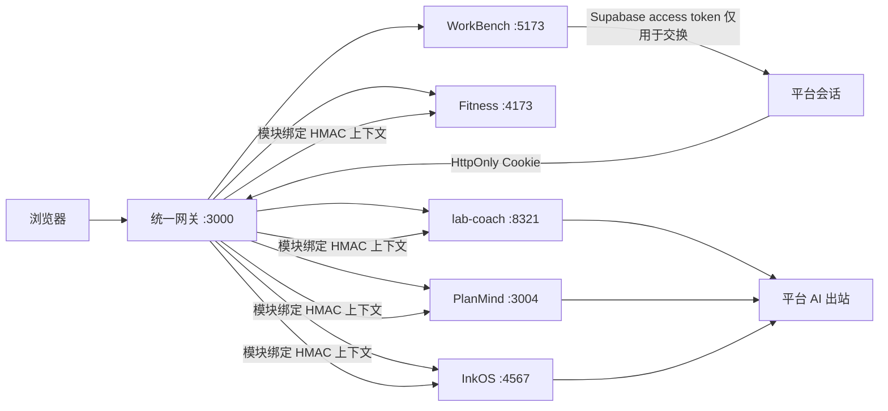

# Person WorkBeach 统一工作台维护说明

> [!INFO] 项目定位
> - **项目物理绝对路径**：`C:\Users\22061\Desktop\Person_WorkBeach`
> - **Git 仓库地址**：`https://github.com/X-8871/Person_WorkBeach.git`
> - **当前分支**：`main`
> - **统一入口**：`http://127.0.0.1:3000/`
> - **核心模块**：`apps/core-workbench`（原 `01_work_bench`）

> [!IMPORTANT]
> Person WorkBeach 是五个项目的**统一运行与治理层**，不是把五套业务逻辑揉成一个单体。接手前必须同时阅读本手册和目标模块自己的维护手册；修改模块内部逻辑时，以对应独立手册的架构红线为准。

## 一、项目物理地址与架构概览

### 1.1 项目目标与当前基线

Person WorkBeach 以 Mouse Workbench 为统一网页壳层，集中提供导航、登录、平台会话、AI 出站、配置、健康调度和故障展示，同时保留 Fitness、lab-coach、Plan Web、InkOS / mNOVA 的独立运行时、依赖、数据和升级节奏。

当前已实现：

- 一个命令启动统一网关和五个模块；
- 一个主页进入全部模块，Fitness 与 PlanMind 固定在左侧导航；
- Supabase 登录交换为短时 HttpOnly 平台会话；
- DeepSeek 官方 API 由平台服务端统一出站，真实密钥只放在本机环境文件；
- 网关签发模块绑定的 HMAC 身份上下文，不转发 Supabase token 或平台 Cookie；
- 单模块故障返回独立错误态，不阻塞主页和其他模块；
- 各模块保留独立启动、测试、数据备份和回滚入口；
- 五个源项目的 Git 历史已导入同一仓库并可追溯。

### 1.2 目录职责

```text
Person_WorkBeach/
├── apps/
│   ├── core-workbench/     # 01：统一壳层、本地工作台、Supabase 与 Obsidian 能力
│   ├── fitness/            # 02：健身建档、训练、复盘与安全分流
│   ├── lab-coach/          # 03：科研学习教练、SQLite 状态机与教学闭环
│   ├── plan-web/           # 04：PlanMind、Obsidian 计划数据与计划 AI
│   └── novel/              # 05：InkOS Studio、mNOVA 与小说项目运行时
├── platform/
│   ├── gateway/            # 同源反向代理、超时、路由和故障隔离
│   ├── control-plane/      # 会话、配置、AI、调度和平台 SQLite
│   ├── contracts/          # 版本化模块身份上下文契约
│   └── migrations/         # 仅平台元数据迁移
├── tools/                  # 启动器、依赖预检、烟测、韧性测试和备份工具
├── docs/adr/               # 架构决策记录
├── docs/integration/       # 注册表、状态、发布与模块维护边界
└── packages/               # 仅公共契约、SDK 或视觉令牌，禁止放领域业务逻辑
```

### 1.3 五模块维护边界

| 模块 | 代码目录 | 数据所有者 | 独立维护手册 |
|---|---|---|---|
| WorkBench | `apps/core-workbench` | IndexedDB、Supabase 工作区、Obsidian 同步服务 | [[Mouse_Workbench与Obsidian同步服务_维护说明]] |
| Fitness | `apps/fitness` | 浏览器 `localStorage` | [[Lzheng Fitness Web 维护说明]] |
| lab-coach | `apps/lab-coach` | `data/lab-coach.db` 与教学状态机 | [[lab-coach_科研学习教练Agent_维护说明]] |
| PlanMind | `apps/plan-web` | Obsidian `08-PLAN`、本机 `config.json` | [[PlanMind计划管理_维护说明]] |
| InkOS / mNOVA | `apps/novel` | 外部小说项目目录、项目级状态与记忆 | [[InkOS_mNOVA小说Agent_维护说明]] |

> [!TIP]
> 平台只拥有会话、公开配置、调度和健康元数据。==平台 SQLite 绝不等于五个领域模块的业务数据库==。

### 1.4 统一调用关系



## 二、运行与部署指令（Runbook）

### 2.1 首次安装与统一启动

```powershell
Set-Location 'C:\Users\22061\Desktop\Person_WorkBeach'
pnpm bootstrap
pnpm dev
```

访问 `http://127.0.0.1:3000/`。启动器先拉起网关，再并行启动通过依赖预检的模块；单模块失败只会让该模块离线。

### 2.2 独立启动

```powershell
pnpm dev:core
pnpm dev:fitness
pnpm dev:lab
pnpm dev:plan
pnpm dev:novel
```

需要通过统一身份和平台 AI 验证某个模块时，必须同时启动网关：

```powershell
pnpm dev -- --only "gateway,core-workbench,lab-coach"
```

### 2.3 验证命令

```powershell
pnpm check:structure
pnpm check:orchestrator
pnpm check:smoke
pnpm check:integration
pnpm check:browser
pnpm check:resilience
pnpm check:resilience:all
pnpm backup -- --dry-run
```

`check:browser` 需要独占 `3000`、`5173`、`4173`，执行前先停止日常 `pnpm dev`。完整发布顺序以项目内 `docs/integration/RELEASE_RUNBOOK.md` 为准。

### 2.4 统一登录与 AI 配置

从 `platform/.env.example` 复制为被 Git 忽略的 `platform/.env`，只在本机填入真实值：

- `WORKBEACH_SUPABASE_URL` 与 `WORKBEACH_SUPABASE_PUBLISHABLE_KEY`：统一登录；
- `WORKBEACH_MODULE_SHARED_SECRET`：模块身份上下文 HMAC；
- `WORKBEACH_AI_BASE_URL`、`WORKBEACH_AI_API_KEY`、`WORKBEACH_AI_MODEL`：统一 AI；
- `WORKBEACH_PLAN_AI_MODE` 与 `WORKBEACH_MODULE_AI_MODE`：`auto`、`platform`、`local` 三种维护模式。

> [!CAUTION]
> `platform/.env`、各模块本地配置、数据库、用户导出文件和包含 API Key 的备份均不得提交 Git，也不得复制进本知识中枢。

### 2.5 备份与恢复边界

```powershell
pnpm backup -- --dry-run
pnpm backup
```

- 平台：`platform/data/workbeach.sqlite`；
- WorkBench：从设置页导出，导出文件可能包含黑猫 API Key，应按敏感资产处理；
- Fitness：浏览器数据不在仓库备份中，需通过模块界面导出；
- lab-coach：停止模块后备份 `apps/lab-coach/data`；
- PlanMind：备份 Obsidian `08-PLAN` 和本机 `config.json`，不得提交密钥；
- InkOS：优先使用自身书籍备份能力，不直接复制运行中的项目级数据库。

恢复时只恢复受影响模块，禁止用某个模块的备份覆盖平台或其他模块。

### 2.6 Git 工作流

所有新开发只在统一仓库提交：

```powershell
Set-Location 'C:\Users\22061\Desktop\Person_WorkBeach'
git status --short
git diff --check
git add -- <本轮相关文件>
git commit -m "<类型>(<模块>): <说明>"
```

原五个仓库只作为历史来源远程保留，不再作为日常提交目标。提交前必须排除 `.env`、数据库、构建产物、运行日志和用户业务数据。

## 三、架构红线与禁忌（Redlines）

> [!CAUTION]
> 以下红线保护“统一入口、模块解耦”的核心目标，未经用户明确批准不得改变。

1. **禁止把五个模块改成共享业务数据库的单体**：领域数据继续由各模块拥有，平台不得直接读写。
2. **禁止跨模块源码调用**：模块之间只允许通过版本化 HTTP API、平台契约或公共 SDK 通信。
3. **禁止破坏独立启动能力**：每个模块必须保留自己的运行时、依赖、测试和升级入口。
4. **禁止把平台 Cookie 或 Supabase token 透传给领域模块**：统一身份只使用网关签名的最小 HMAC 上下文。
5. **禁止接受浏览器伪造的 `X-WorkBeach-*` 头**：网关必须清理并重新签发，模块必须校验签名、模块 ID 和有效期。
6. **禁止把真实密钥写入源码、Git、Obsidian 普通知识笔记或浏览器公开配置**。
7. **禁止单模块故障拖垮统一主页**：上游超时、502、健康降级和重试必须保持模块级隔离。
8. **禁止删除或压平导入历史**：五个源项目提交、作者和时间线必须继续可追溯。
9. **禁止用统一备份替代领域备份**：平台备份不包含完整的 WorkBench、Fitness、lab-coach、PlanMind 和 InkOS 数据。
10. **禁止在未完成生产验收前宣称公网生产就绪**：当前是本机融合基线，生产 HTTPS、外部密钥管理、集中日志与长时稳定性仍需独立验收。
11. **禁止读取或上传 `05-Private_Vault`**：除非用户在当前对话中明确授权访问私密库。
12. **模块内部修改继续受各自手册红线约束**：本总手册不能覆盖教学状态机、健身安全、计划数据、小说契约或 WorkBench 同步协议的专属约束。

## 四、故障排查与已知问题记录

| 现象 / 风险 | 根本原因 | 标准处理 | 当前状态 |
|---|---|---|---|
| Supabase 会话交换偶发 503 | Node 到身份服务实际响应曾超过硬编码 5 秒 | 身份校验默认改为 10 秒，并限制在 1～30 秒范围 | 已修复，提交 `4a026209` |
| Windows 浏览器烟测残留子进程 | 旧脚本未完整隔离和回收进程树 | 独占端口预检、直接启动编排器、等待端口释放 | 已修复，提交 `17c5caae` |
| LAB / Novel 未走统一 AI | 没有平台会话或模块上下文时，`auto` 会保持独立模式 | 从统一入口登录；检查平台 AI 状态、HMAC 配置和模块模式 | 最小真实 DeepSeek 请求已通过 |
| PlanMind 仍有本地 `config.json` | 为保留模块离线维护能力 | 统一模式优先平台 AI；未经确认不删除本地配置 | 待用户决定 |
| 某模块离线但主页正常 | 故障隔离的设计行为 | 查看模块卡片、对应健康接口和模块日志，只重启受影响模块 | 预期行为 |
| 停止后端口仍被占用 | Windows 子进程未随父进程结束 | 先按端口确认 PID 和命令行属于本仓库，再精确停止对应进程 | 已有标准流程 |
| 全业务流程尚未验收 | 用户当前选择暂停验收 | 保留本机融合基线，后续从项目 `HANDOFF.md` 接续 | 当前状态 |

### 当前接手状态（2026-08-28，UTC+8）

- [x] 五项目 Git 历史并入单仓库；
- [x] 统一主页、左侧导航、登录、平台会话、AI、配置、调度和健康状态已接入；
- [x] 五模块一键启动、全模块入口检查、浏览器烟测和故障隔离测试已建立；
- [x] DeepSeek 官方 API 最小真实请求返回成功；
- [x] 工作台账号已登录并执行一次同步；
- [ ] 各模块补充业务对象级用户数据所有权校验；
- [ ] lab-coach 与 InkOS / mNOVA 完整真实业务流程及小时级长时稳定性；
- [ ] 真实设备 UI 视觉回归；
- [ ] 公网生产基础设施与发布验收。

## 关联文档

- [[Mouse_Workbench与Obsidian同步服务_维护说明]]
- [[Lzheng Fitness Web 维护说明]]
- [[lab-coach_科研学习教练Agent_维护说明]]
- [[PlanMind计划管理_维护说明]]
- [[InkOS_mNOVA小说Agent_维护说明]]
- [[大文件清单式原子同步验收SOP]]
- [[HANDOFF_PROTOCOL]]
- [[Git与GitHub连接配置]]

