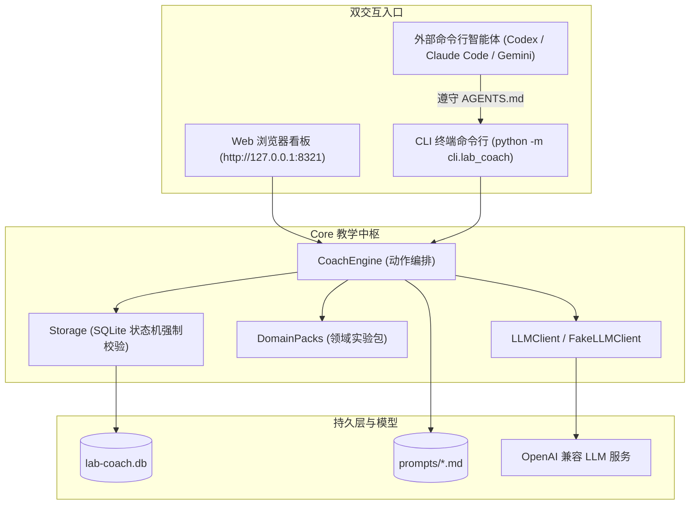
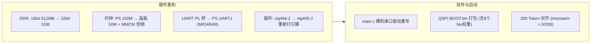

# lab-coach 科研学习教练 Agent 维护说明

> [!INFO] 项目定位
> - **项目物理绝对路径**：`C:\Users\22061\Desktop\Person_workdesk\03_lab-coach`
> - **Git 仓库地址**：`https://github.com/X-8871/lab_coach.git`

> [!IMPORTANT]
> 任何 AI 在接手、重构或使用本项目前，必须通读本手册，并**严格遵守第三节「架构红线与禁忌」**。
> 教学交互与提示分级 SOP 详见 [[lab-coach_苏格拉底科研教学闭环SOP]]，开发环境基线详见 [[常用开发环境与工具链]]。

---

## 一、 项目物理地址与架构概览

### 1.1 项目核心定位与主张
`lab-coach` 是一套面向科研新人的 AI Agent 教学与实验闭环系统。它的核心使命是：**把导师的一句话任务（如“把这个模型部署到那块板子上”）转化为一门结构化的个人实验课**。
- **人是执行主体，AI 是引导者**。
- **任务的完成不是终点，==能讲清楚为什么==才是终点**。
- 系统负责出题、引导、追问、评审与验收；用户亲手执行并记录数据。

### 1.2 核心技术栈与环境基线

| 维度 | 技术选型与规范 |
| :--- | :--- |
| **编程语言 & 运行时** | Python 3.10+（本机推荐 Python 3.12） |
| **Web 框架 & 通信** | Flask + Jinja2 + Server-Sent Events (SSE) 流式对话 |
| **数据持久化** | SQLite 3 (`data/lab-coach.db`)，内置严格业务状态机 |
| **LLM 客户端** | OpenAI API 兼容客户端（支持 DeepSeek / OpenAI / Moonshot / vLLM / Ollama） + 离线 `FakeLLMClient` |
| **交互双入口** | **Web UI**（端口 `8321`） + **CLI**（`python -m cli.lab_coach`，支持外部智能体代理） |
| **领域实验包** | YAML 驱动的领域模板包（首发 `edge-deploy`：边缘模型部署） |

### 1.3 核心目录职责划分

```text
03_lab-coach/
├── app/                    # Web UI 模块 (Flask + Jinja2 模板 + SSE 流式聊天)
│   ├── static/style.css    # 样式表
│   ├── templates/          # 视图模板 (dashboard, project, chat, report, challenge, settings)
│   ├── web.py              # Flask Web 路由与 API 实现
│   └── run.py              # Web 启动入口 (默认端口 8321)
├── cli/                    # 命令行模块 (CLI 入口)
│   └── lab_coach.py        # 包含 14 个完整子命令的命令行教学驱动器
├── core/                   # 核心中枢 (与 Web/CLI 完全解耦的教学大脑)
│   ├── config.py           # YAML 配置解析与数据类
│   ├── engine.py           # CoachEngine: 教学动作编排、JSON 鲁棒解析
│   ├── storage.py          # SQLite 存储层与状态机强断言
│   ├── llm.py              # LLM 客户端封装与离线 FakeLLM
│   └── packs.py            # 领域实验模板包加载器
├── docs/                   # 项目设计与实战方案文档
│   └── plans/              # 包含 NanoGPT AX7020 移植部署方案等
├── packs/                  # 可插拔领域模板包 (题库与挑战库)
│   └── edge-deploy/        # 边缘模型部署领域包 (pack.yaml)
├── prompts/                # 9 大教学动作专属提示词 (Markdown)
│   ├── decompose.md        # 任务接案与 5 阶段路线图拆解
│   ├── design-experiments.md # 阶段实验单生成
│   ├── coach-chat.md       # 苏格拉底日常引导对话
│   ├── review-experiment.md # 实验记录评审
│   ├── report-guide.md     # 报告撰写引导提问
│   ├── report-review.md    # 报告深度评审
│   ├── summary-report.md   # 项目总报告生成
│   ├── challenge.md        # 进阶研究型挑战出题
│   └── reveal.md           # 答案揭晓与强制反思
├── data/                   # 运行数据归档 (lab-coach.db，已 .gitignore)
├── AGENTS.md               # 命令行智能体代理协议 (教 Codex/Claude/Gemini 如何当嘴)
├── config.yaml             # 运行时配置 (API Key/BaseURL/严格度，已 .gitignore)
└── requirements.txt        # 依赖清单
```

### 1.4 双入口架构与数据流拓扑



---

## 二、 运行与部署指令 (Runbook)

### 2.1 本地环境配置与启动
```powershell
# 1. 进入工作目录
cd C:\Users\22061\Desktop\Person_workdesk\03_lab-coach

# 2. 安装依赖 (Python 3.10+)
pip install -r requirements.txt

# 3. 配置文件准备
copy config.yaml.example config.yaml
# 编辑 config.yaml 填入 base_url / api_key / model

# 4. 配置连通性检查 (支持 Ping 测试)
python -m cli.lab_coach config-check --ping

# 5. 启动 Web 学习看板 (浏览器访问 http://127.0.0.1:8321)
python -m app.run
```

### 2.2 CLI 教学驱动全指令集速查

| 阶段/类别 | 完整指令 | 功能说明与参数 |
| :--- | :--- | :--- |
| **立项接案** | `python -m cli.lab_coach new-task "导师任务原话" [--pack edge-deploy]` | 输入任务原话，调用 LLM 拆解为 5 阶段路线图并建档 |
| **项目列表** | `python -m cli.lab_coach projects` | 查看所有接案项目状态与通过率 |
| **项目详情** | `python -m cli.lab_coach project <pid>` | 查阅项目目标、路线图、实验列表、概念清单与指标 |
| **出实验单** | `python -m cli.lab_coach gen <pid> [--phase 阶段名]` | 为当前阶段生成结构化实验单（目的/步骤/数据项/预期） |
| **查看实验** | `python -m cli.lab_coach experiments <pid>` / `experiment <eid>` | 概览全部实验 / 查看具体实验单详细要求 |
| **开始实验** | `python -m cli.lab_coach start <eid> [--predict "预测值"]` | 标记实验为进行中（`doing`），**强制要求输入做前预测** |
| **记录数据** | `python -m cli.lab_coach record <eid> --notes "实测数据与现象"` | 追加实验实测数据、现象或反思（可多次调用） |
| **提交审核** | `python -m cli.lab_coach submit <eid>` | 提交实验审核（`review`）；**无数据记录时会被底层状态机拦截** |
| **教练评审** | `python -m cli.lab_coach review <eid>` | 触发教练评审；输出通过（`passed`）或打回（`rejected`）评语 |
| **放弃跳过** | `python -m cli.lab_coach skip <eid> --reason "跳过理由"` | 跳过实验；**必须输入详细原因，状态标记为 skipped** |
| **撰写报告** | `python -m cli.lab_coach write-report <eid>` | 根据实测数据生成实验报告草稿（`draft`） |
| **报告引导** | `python -m cli.lab_coach guide <rid>` | 教练针对实测数据抛出 2~3 个引导性深度分析问题 |
| **提交/评审** | `python -m cli.lab_coach submit-report <rid>` / `review-report <rid>` | 提交报告 $\to$ 教练深度评审（深度不足必打回） |
| **总结报告** | `python -m cli.lab_coach summary <pid>` | 汇总全阶段实验数据生成项目总报告骨架（保留待补分析） |
| **导出报告** | `python -m cli.lab_coach export-report <rid>` | 导出为独立排版的 Markdown 文件 |
| **进阶挑战** | `python -m cli.lab_coach challenge <pid> [--pick 序号]` | 生成高阶挑战题 / 选定挑战并自动生成进阶实验单 |
| **教练对话** | `python -m cli.lab_coach chat <pid> [--experiment <eid>]` | 进入交互式苏格拉底引导对话终端 |

---

## 三、 🚫 架构红线与禁忌 (Architectural Redlines)

> [!CAUTION]
> **以下为 lab-coach 系统的绝对红线，任何 AI 或人类开发者严禁违背：**

### 1. 教学交互四大红线（苏格拉底契约）
1. **🚫 严禁编写“复制即跑”的完整脚本**：除了用户在 L4 等级明确请求揭晓外，教练绝不允许输出拿来就能直接代跑的整套部署/训练脚本。
2. **🚫 严禁替用户决定实验参数**：当用户询问参数时，必须反问其硬件规格与验证意图（如“你的板子显存多大？你想探索什么边界？”）。
3. **🚫 无数据/无分析的报告一律打回**：实验记录为空时禁止提交审核；实验报告缺少对比数据或深层归因时，评审必须判定为 `rejected`。
4. **🚫 严禁无声跳过实验**：状态机严禁跨阶段跳步，如确需放弃，必须通过 `skip --reason` 记录详细原因入库。

### 2. 底层架构与状态机红线
1. **🚫 严禁绕过 CLI / Storage 直接修改数据库**：
   - 外部 Agent 或脚本绝不允许直接执行 `sqlite3` 修改 `status`。所有状态转移必须经过 `Storage.update_experiment_status()` 校验。
2. **🚫 状态机流转不可逆与不可越权**：
   - 实验单状态机规则：`todo -> doing/skipped`，`doing -> review/todo/skipped`，`review -> passed/rejected/doing`。未进 `review` 绝不允许变为 `passed`。
3. **🚫 L5 委托执行三确认与讲解原则**：
   - 用户要求“帮我跑”时触发 L5 委托，但执行前必须确认：① 从哪一步跑到哪一步（到点即停）；② 使用什么参数；③ 事后必须逐步讲解并提问。数据库必须标记 `assisted=1`。

---

## 四、 故障排查与已知问题记录

| 典型问题 / 报错现象 | 根本原因 | 标准排查与恢复手段 |
| :--- | :--- | :--- |
| `无法提交审核：实验尚未记录任何数据` | `Storage` 状态机拦截空数据提交 | 先执行 `python -m cli.lab_coach record <eid> --notes "具体数据"`，再执行 `submit` |
| `LLM JSON 输出解析失败` | 某些小模型输出了 Markdown 闲聊前缀 | `core/engine.py` 内置了 `parse_json_robust` 正则提取器，若仍报错，检查模型 temperature 或切换到更强模型 |
| Windows 控制台输出中文乱码 | 控制台代码页非 UTF-8 (默认 GBK 936) | 在终端先执行 `chcp 65001` 切换代码页，或设置 `PYTHONIOENCODING=utf-8` |
| `LLM 调用失败: Connection refused` | `config.yaml` 中 `base_url` 无法访问或端口未开 | 检查本地模型服务（Ollama/vLLM）是否启动，或在 `config.yaml` 设置 `llm.fake: true` 使用离线桩 |
| `端口 8321 被占用` | 残留后台 Flask 进程未释放 | 执行 `netstat -ano \| findstr :8321` 查询 PID 并通过 `taskkill /F /PID <pid>` 终止 |

---

## 五、 实战案例方案：NanoGPT Zynq → AX7020 移植部署

> 本项目 `docs/plans/2026-08-21-ax7020-deployment-plan.md` 记录了完整的边缘部署案例：

### 5.1 软硬件改造基线



- **硬件差异**：器件由 `xc7z020clg484-2` 换为 `xc7z020clg400-2`；DDR 改为 **32 Bit 1GB**；添加 **MMCM IP**（50MHz 晶振 $\to$ 100MHz）；串口改为 **PS UART1 (MIO48/49)**。
- **软件改造**：`ps/src/main.c` 驱动重写为轮询 `PS_UART_BASE (0xE0001000)`。
- **验收标准**：QSPI Flash 独立启动；串口打印 `nanoGPT Zynq UART ready`；**200 token 板端生成与 PC golden 对齐（0 误码）**；测定基线速度（基准：7.72 char/s @ 100MHz）。

---

## 🔗 相关中枢文档与双链

- 知识中枢总览：[[00-AI知识中枢总览]]
- 教学闭环 SOP：[[lab-coach_苏格拉底科研教学闭环SOP]]
- 本机环境基线：[[常用开发环境与工具链]]
- 全局 AI 宪法：[[AGENT_CORE]]
